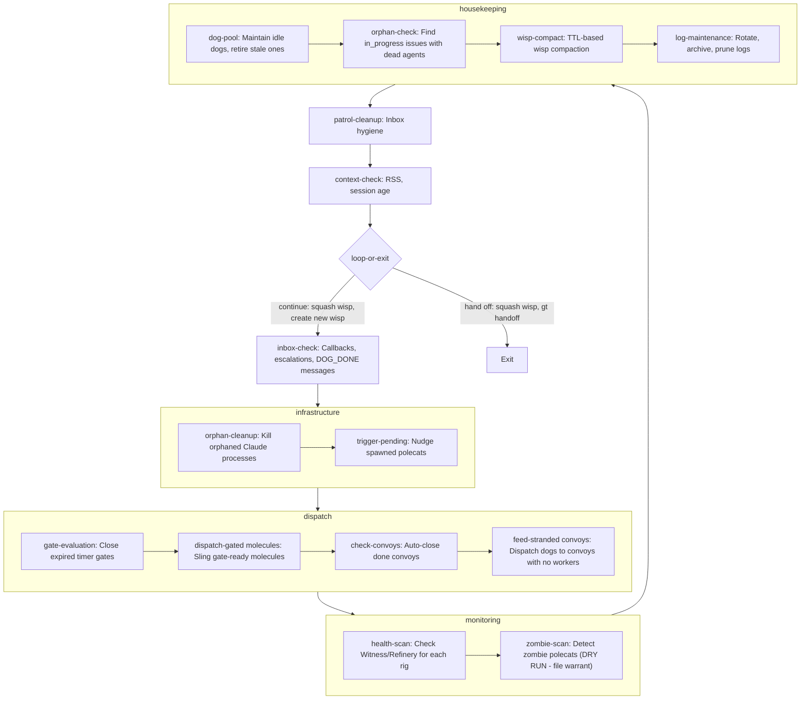
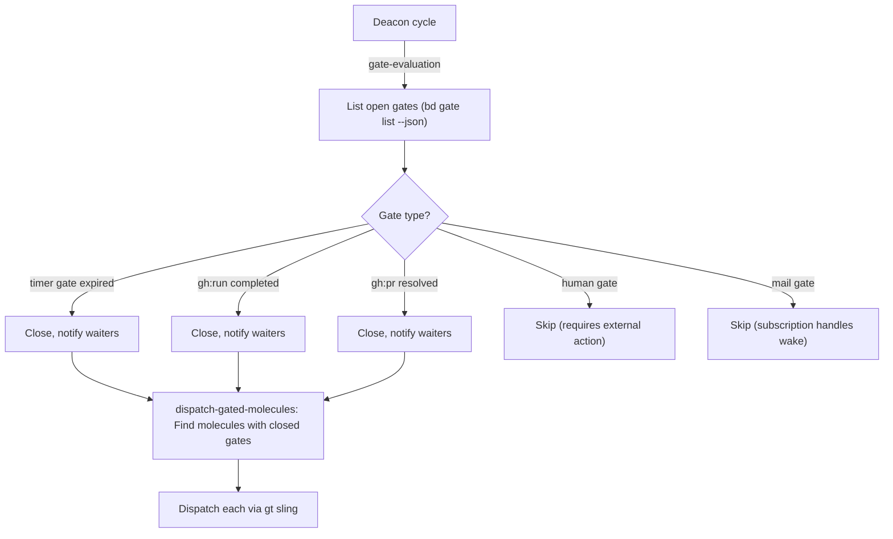
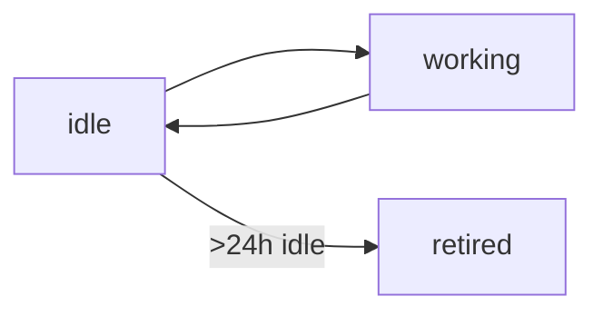
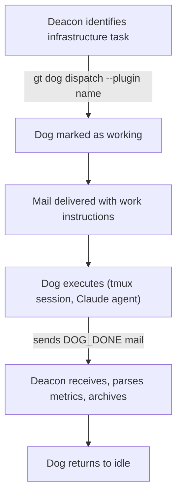
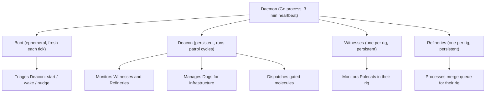
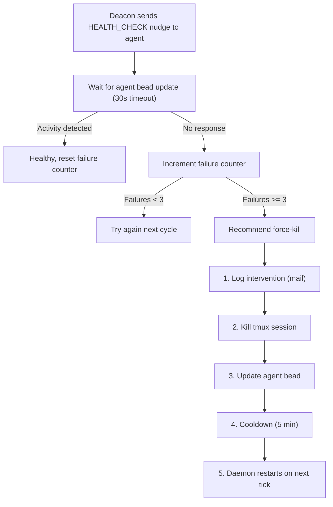
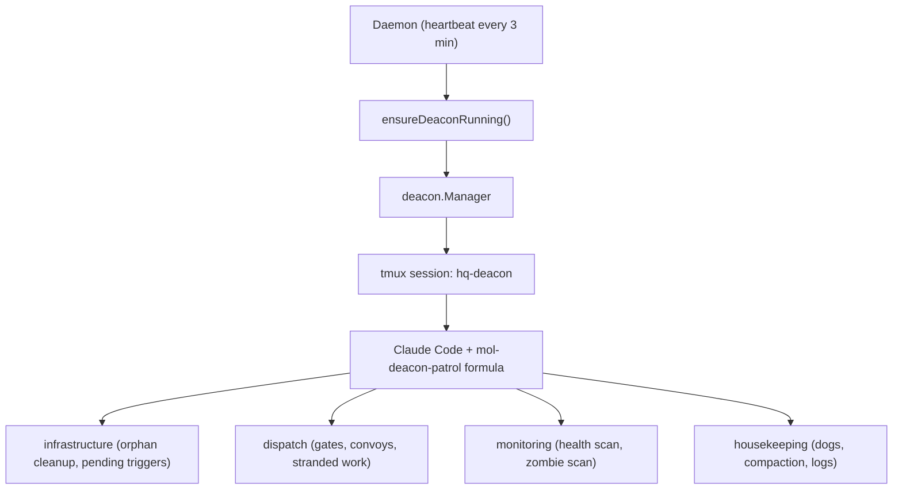

# Deacon Patrol

> The town-wide orchestrator. Spawns workers, monitors health, manages gates,
> dispatches dogs, and keeps every rig running.

## The Patrol Loop

The Deacon patrol is a formula-driven loop. Each iteration handles mail,
maintains infrastructure, dispatches work, checks health, and runs housekeeping.
The Deacon is the longest patrol formula (~1000 lines, 20+ steps) because it
covers the widest scope: the entire town.

## Step Groups

The Deacon's steps fall into four groups, executed in order each cycle.

### Infrastructure

**orphan-cleanup** — Kill orphaned Claude subagent processes (those with
`TTY="?"` that have lost their parent session). Prevents memory leaks from
crashed sessions.

**trigger-pending** — Find spawned polecats that are ready for their initial
input and send them a nudge trigger. This is the bootstrap mechanism for
newly-created polecat sessions.

### Dispatch

**gate-evaluation** — Check all open gates. Close timer gates when their
timeout has elapsed. Notify waiters when gates close. See
[Gates](#gates-async-coordination) below.

**dispatch-gated-molecules** — Find molecules that were blocked on gates which
are now closed. Dispatch each one via `gt sling` to the appropriate rig.

**check-convoys** — Run `gt convoy check` to auto-close convoys where all
tracked issues are resolved. Fire completion notifications.

**feed-stranded-convoys** — Find convoys that have ready issues but no workers
assigned. Dispatch dogs to pick up the stranded work.

### Monitoring

**health-scan** — Check Witness and Refinery health for each rig. Skips
docked/parked rigs. When no active work exists, only verifies sessions exist
(no nudge spam). When active work exists, sends `HEALTH_CHECK` nudges.
Tracks consecutive failures; escalates to Mayor after 5+ failed cycles.

**zombie-scan** — Detect zombie polecats across all rigs. The Deacon does NOT
kill zombies directly — it files death warrants that Boot handles. This
separation prevents the orchestrator from accidentally killing live sessions.

### Housekeeping

**dog-pool** — Ensure at least one idle dog is available. Spawn on demand if
the pool is empty. Optionally retire dogs that have been idle for >24 hours.
Maximum 4 dogs total. See [Dog Pool](#the-dog-pool) below.

**orphan-check** — Find `in_progress` issues whose assigned agents are dead.
Dispatch a dog for recovery rather than fixing inline.

**wisp-compact** — Run TTL-based compaction on expired wisps, freeing space
in the beads database.

**log-maintenance** — Rotate logs >10MB, archive logs >7 days, prune stale
`state.json` files.

## Gates: Async Coordination

Gates are async coordination primitives that let molecules pause and resume
without tying up an agent. A molecule step can create a gate, and the Deacon
evaluates gates each cycle.

| Gate type | Created by | Closed when |
|-----------|-----------|-------------|
| `timer` | Molecule step | Time elapsed (`CreatedAt + Timeout < Now`) |
| `gh:run` | Polecat/workflow | GitHub Actions run completes |
| `gh:pr` | Polecat/workflow | Pull request merged or closed |
| `human` | Any step | Human runs `bd gate approve <gate-id>` |
| `mail` | Any step | Expected message arrives |

The evaluation flow:

Gates enable async resume without explicit waiter tracking. The Deacon
discovers reality each cycle — if a gate is closed and a molecule is ready,
it dispatches. No persistent subscription state needed.

## The Dog Pool

Dogs are reusable infrastructure workers managed by the Deacon. Unlike polecats
(which are spawned for one task and nuked), dogs persist between tasks and
return to idle when their work is done.

| Property | Polecats | Dogs |
|----------|----------|------|
| **Lifecycle** | Spawn → work → nuke | Idle → work → idle |
| **Scope** | Single rig | Cross-rig (multi-worktree) |
| **Manager** | Witness | Deacon |
| **Max count** | Configurable per rig | 4 total |
| **Purpose** | Feature work | Infrastructure/cleanup |

### Dog states

### Dispatch flow

Dogs have worktrees into every configured rig, so they can work across rig
boundaries without the overhead of creating temporary clones. This makes them
ideal for cross-rig cleanup, dependency resolution, and infrastructure tasks.

## The Watchdog Chain

The Deacon sits in the middle of a multi-layer monitoring hierarchy:

Each layer only monitors the layer below it. The Daemon ensures the Deacon is
running. The Deacon ensures Witnesses and Refineries are running. Witnesses
ensure polecats are running.

### Second-order monitoring

Who watches the Deacon? Witnesses do — passively. They check the Deacon's
`last_activity` timestamp on its agent bead each cycle. If the Deacon is
stale for >5 minutes, the Witness escalates to the Mayor. No heartbeat mail
spam required.

### Boot: the ephemeral triage agent

Boot is spawned fresh every daemon heartbeat. Its sole job: look at the Deacon
and decide whether to start, nudge, or kill it. Boot is intentionally
short-lived — it makes one decision and exits. This prevents Boot itself from
becoming a reliability concern.

## Health Check Protocol

The Deacon monitors Witness and Refinery health using a nudge-and-wait pattern:

### Idle town optimization

When no active work exists across any rig, the Deacon skips health check
nudges and only verifies that sessions exist. This prevents unnecessary noise
in quiet towns. The Deacon stays silent when the town is healthy and idle.

## Resilience

### Auto-respawn

The Deacon's tmux session has a pane-died hook that automatically restarts
Claude if it exits. This handles crashes without waiting for the next daemon
heartbeat (3 minutes). The daemon is a safety net, not the primary recovery
mechanism.

### Grace periods

| Scenario | Grace period |
|----------|-------------|
| Startup | 5 min before heartbeat check |
| Health check response | 30s wait for bead update |
| Force-kill cooldown | 5 min between kills of same agent |
| Stale hook max age | 1 hour before cleanup |

### Nudge and kill thresholds

| Deacon age | Action |
|------------|--------|
| Fresh (< threshold) | Nothing |
| 5-10 min stale | Nudge to wake |
| >10 min stale | Restart |

## The Idle Town Principle

The Deacon follows a key design principle: silence when healthy.

- No `HEALTH_CHECK` nudges when no active work exists
- Exponential backoff between cycles (60s → 120s → 240s → 5m max)
- Feed subscription wakes immediately on real events
- Daemon heartbeat is safety net only, not the driver

This means a quiet town consumes minimal resources. The Deacon checks in every
5 minutes at most, and only runs full monitoring when work is actually happening.

## Architecture

The Deacon is a town-level singleton — one per Gas Town installation. Unlike
Witnesses and Refineries (which are per-rig), the Deacon sees across all rigs.
Its session name is `hq-deacon`, reflecting its town-wide scope.

See [Patrols Overview](./overview.md) for the universal patrol lifecycle,
[Witness Patrol](./witness.md) for per-rig polecat monitoring, and
[Refinery Patrol](./refinery.md) for merge queue processing.
