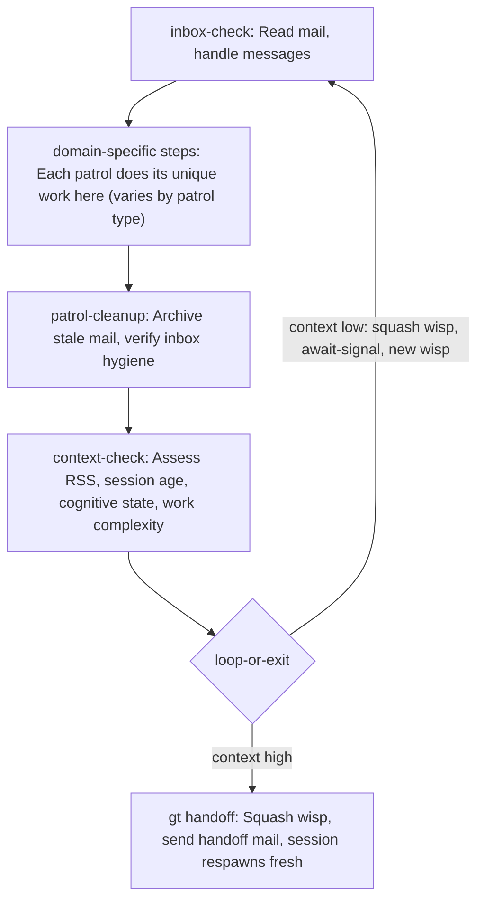
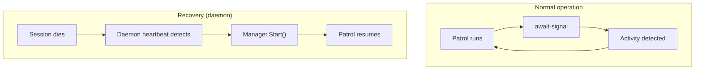
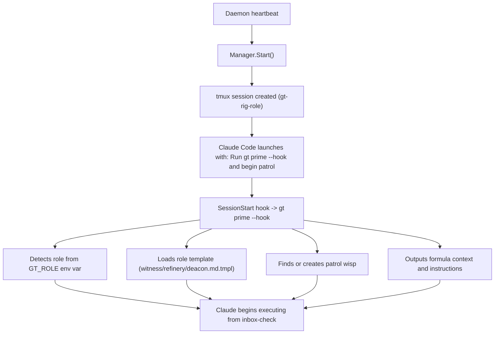

# Patrols

> Always-running, formula-driven agents that cycle indefinitely. The heartbeat
> of Gas Town.

## Overview

A patrol is an agent that runs a continuous loop: check for work, do work, check
context, cycle. Unlike polecats (which are spawned, do one task, and die) or crew
workers (which are interactive and human-directed), patrols are autonomous and
infinite. They are the background processes that keep Gas Town running.

There are exactly three patrols:

| Patrol | Scope | What it does |
|--------|-------|-------------|
| **Deacon** | Town-wide (singleton) | Orchestration — spawns, health checks, cleanup, dispatch |
| **Witness** | Per-rig | Polecat lifecycle — monitors workers, handles completions |
| **Refinery** | Per-rig | Merge queue — processes MRs, runs quality gates, merges code |

Each patrol has its own formula (`mol-deacon-patrol`, `mol-witness-patrol`,
`mol-refinery-patrol`) that defines the steps in its cycle. The formula is the
patrol's brain; the commands it calls are the muscles.

## The Patrol Loop

Every patrol follows the same high-level pattern. The specifics differ (the
Deacon checks spawns and health, the Witness monitors polecats, the Refinery
processes MRs) but the structure is identical:



Every patrol begins with `inbox-check` and ends with a decision: cycle (squash
and loop) or hand off (exit for a fresh session). The domain-specific steps in
the middle are what make each patrol unique.

## Wisps: The Unit of Work

Each patrol cycle runs as a **wisp** — an ephemeral molecule. When a cycle ends:

1. The wisp is **squashed** into a digest (permanent summary record)
2. A **new wisp** is created from the same formula
3. The patrol continues from `inbox-check` on the fresh wisp

This means every cycle is a clean work unit. Wisps are beads themselves (stored
in the beads DB with `Ephemeral=true` and `-wisp-` in their ID), but they're
designed to be squashed into a digest after each cycle. The state that persists
across wisp boundaries — issues, MRs, tasks, dependencies, mail — are regular
beads that the patrol reads fresh each cycle. The patrol doesn't carry state in
its wisp; it queries the bead store. Squashing the wisp captures what happened
during that cycle as a permanent digest without cluttering the agent's working
memory.

The wisp type for all patrols is `"patrol"`, distinguishing them from polecat
work wisps.

## Await-Signal: Event-Driven, Not Polling

Between patrol cycles, agents don't busy-wait. They subscribe to the beads
activity feed:

```bash
gt mol step await-signal
```

This command:
1. Subscribes to `bd activity --follow` (the beads event stream)
2. Returns immediately when any activity occurs (new bead, status change, mail)
3. If no activity, times out with exponential backoff

### Backoff

Consecutive idle cycles increase the wait time:

```
timeout = min(base × multiplier^idle_cycles, max)
```

| Patrol | Base | Max | Sequence |
|--------|------|-----|----------|
| Witness, Refinery | 30s | 5m | 30s → 60s → 120s → 240s → 300s |
| Deacon | 60s | 5m | 60s → 120s → 240s → 300s |

When a signal arrives, the idle counter resets to 0. This means patrols respond
quickly to bursts of activity (30s latency) but back off gracefully during quiet
periods (5m max between checks).

The idle counter and backoff state are persisted as labels on the agent's bead,
so interrupted cycles (e.g., from a nudge) resume with the correct remaining
time.

## The Daemon: Safety Net, Not Orchestrator

The daemon is a Go background process (not a Claude agent) that runs a heartbeat
every 3 minutes. It does **not** drive patrol logic — that's the formula's job.
The daemon's sole purpose is recovery:

| Daemon checks | What it does |
|--------------|-------------|
| Session missing | Restarts via Manager.Start() |
| Deacon stuck | Nudges at 5 min, kills at 10 min |
| Zombie session | Kills tmux session with dead Claude process |
| Patrol disabled | Kills leftover sessions |

The daemon is deliberately "dumb." All intelligence lives in the patrol agents.
The daemon just makes sure they're running.



The patrol picks up exactly where it left off because all state is in beads.
There's no checkpoint to restore — the new session reads the queue/bead state
fresh.

## Startup Sequence

When a patrol session starts (fresh spawn or daemon recovery):



The startup prompt is always the same: `"Run gt prime --hook and begin patrol."`
The `gt prime` command does the heavy lifting — detecting the role, loading the
formula, and presenting the work. This means recovery is identical to first boot.

## How Patrols Differ

| | Patrols | Polecats | Crew |
|---|---------|----------|------|
| **Lifecycle** | Infinite loop | Finite (spawn → work → done → nuke) |  Long-lived, interactive |
| **Work source** | Self-directed via formula | Slinged by Witness/Deacon | Human-directed |
| **Session persistence** | Daemon ensures always running | Self-nuke on completion | Manual start/stop |
| **Exit behavior** | Never exit (only handoff) | `gt done` → self-destruct | User terminates |
| **Identity** | Singleton per scope | Pool of named workers | Named crew members |
| **Idle state** | `await-signal` (event-driven) | None (no idle polecats) | Waiting for user |
| **Formula type** | `mol-*-patrol` | `mol-polecat-work`, `shiny`, etc. | None |

The key insight: polecats have **no idle state** (working, stalled, or zombie —
that's it). Patrols, by contrast, are *always* running. Their "idle" is
`await-signal`, not absence.

For detailed documentation on each patrol, see:
- [Deacon Patrol](./deacon.md) — town-wide orchestration
- [Witness Patrol](./witness.md) — per-rig polecat lifecycle
- [Refinery Patrol](./refinery.md) — per-rig merge queue

## Configuration

Each patrol can be enabled/disabled via the daemon config (`mayor/daemon.json`):

```json
{
  "patrols": {
    "refinery": { "enabled": true },
    "witness":  { "enabled": true },
    "deacon":   { "enabled": true }
  }
}
```

When a patrol is disabled, the daemon kills any existing sessions for it.
When re-enabled, the next heartbeat starts it up.

Rig-level patrols (witness, refinery) can also be controlled per-rig via
`gt rig park/unpark` (temporary) or `gt rig dock/undock` (persistent). A parked
or docked rig's patrol agents won't be started by the daemon.
