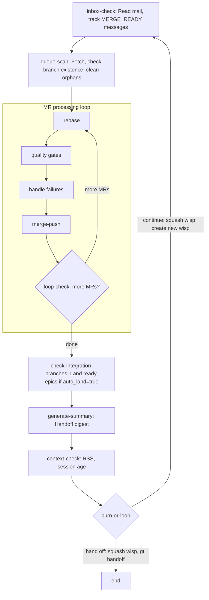

# Refinery Patrol

> The continuous loop that drives the Refinery. Checks mail, processes MRs,
> manages integration branches, and cycles when context fills up.

## The Patrol Loop

The Refinery patrol is a formula-driven loop. Each iteration processes all
queued MRs, then checks integration branches, then decides whether to continue
or hand off. The entire loop runs as a wisp (ephemeral molecule).

## Step Breakdown

### inbox-check

Read incoming mail. Track MERGE_READY messages — these carry the MR ID, branch,
polecat name, and message ID that Claude must remember for later steps. Archive
PATROL, HELP, and HANDOFF messages after handling.

### queue-scan

Fetch latest refs, check the beads merge queue (`gt mq list`). Verify that
branches for open MRs still exist. Close orphaned MR beads whose branches are
gone.

### The Inner Loop (rebase → quality gates → handle failures → merge-push)

This is the core of the Refinery. For each MR in the queue, Claude follows
the formula's prose instructions to:

1. **Rebase** — `git checkout -b temp origin/<branch>`, `git rebase origin/main`.
   If conflicts: `git rebase --abort`, create a conflict task via `bd create`,
   skip to loop-check.

2. **Quality gates** — Run configured commands (setup, typecheck, lint, build,
   test) on the rebased branch. If any fail, proceed to handle-failures.

3. **Handle failures** — Diagnose whether the failure is a branch regression
   or pre-existing on the target. If branch-caused: reopen the source issue,
   send MERGE_FAILED to the Witness, close the MR bead, delete the branch.
   If pre-existing: file a bead for the issue and proceed with merge.

4. **Merge and push** — `git checkout main`, `git merge --ff-only temp`,
   `git push`. Verify the push succeeded (compare local vs remote SHA).
   Send MERGED to the Witness, close the MR bead, archive the MERGE_READY
   mail, delete the source branch.

### loop-check

Check if more MRs remain in the queue. If yes, loop back to rebase. If no,
proceed to post-processing.

### check-integration-branches

If integration branch support is enabled, check for epics ready to land.
If `auto_land` is true, land them via `gt mq integration land`.

### context-check / burn-or-loop

Assess session health and decide whether to continue or hand off.

## What Claude Handles Inline

On the current codebase, Claude handles all merge mechanics directly through
formula prose instructions. There are no dedicated merge commands — Claude
runs raw git commands and bead/mail commands as the formula specifies.

| Responsibility | How |
|---------------|-----|
| Git rebase | Claude runs `git checkout -b temp ...`, `git rebase ...` |
| Git merge | Claude runs `git merge --ff-only temp` |
| Git push | Claude runs `git push origin main` |
| Push verification | Claude compares `git rev-parse main` vs `origin/main` |
| MERGED notification | Claude runs `gt mail send <rig>/witness ...` |
| MR bead close | Claude runs `bd close <mr-id> --reason "..."` |
| Branch cleanup | Claude runs `git push origin --delete <branch>` |
| Conflict task creation | Claude runs `bd create --type=task ...` |
| Failure diagnosis | Claude checks out target, re-runs gate, compares |

This approach relies on Claude remembering values (branch names, polecat names,
MR bead IDs) across formula steps and executing each bookkeeping step in order.

See [Refinery Issues](../../issues/refinery.md) for known problems with this
approach, and [Refinery Patrol v2](./refinery-v2.md) for the proposed
three-command pipeline.
