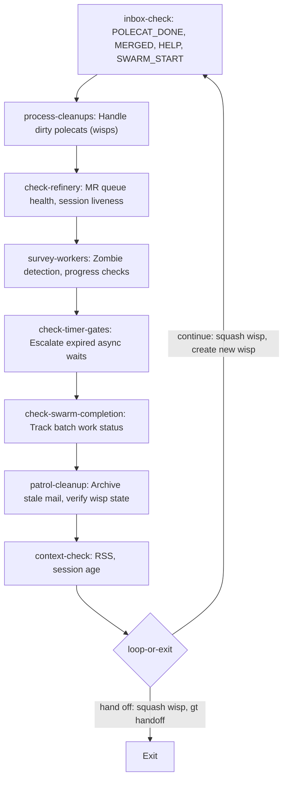
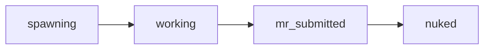
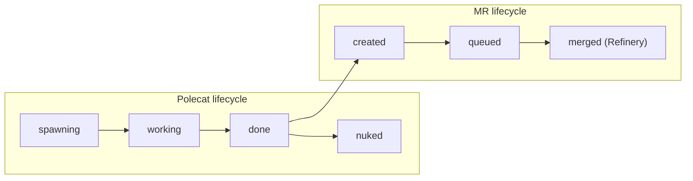
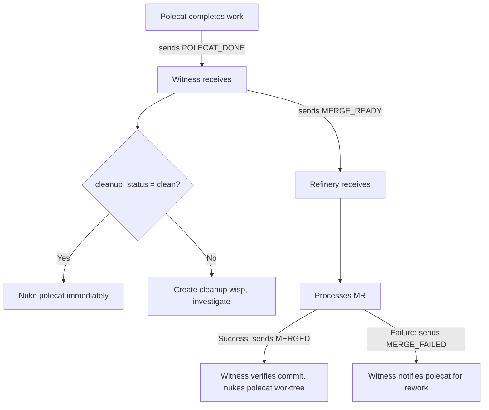
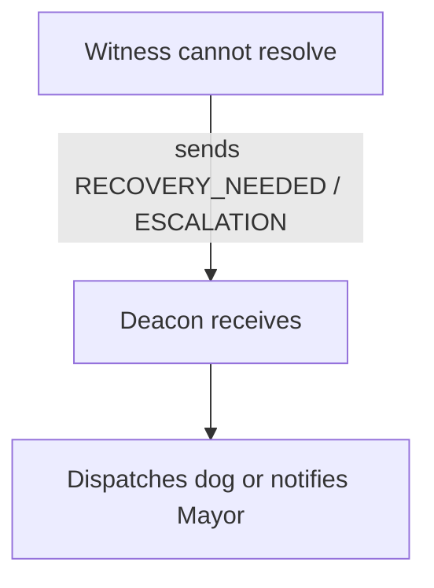
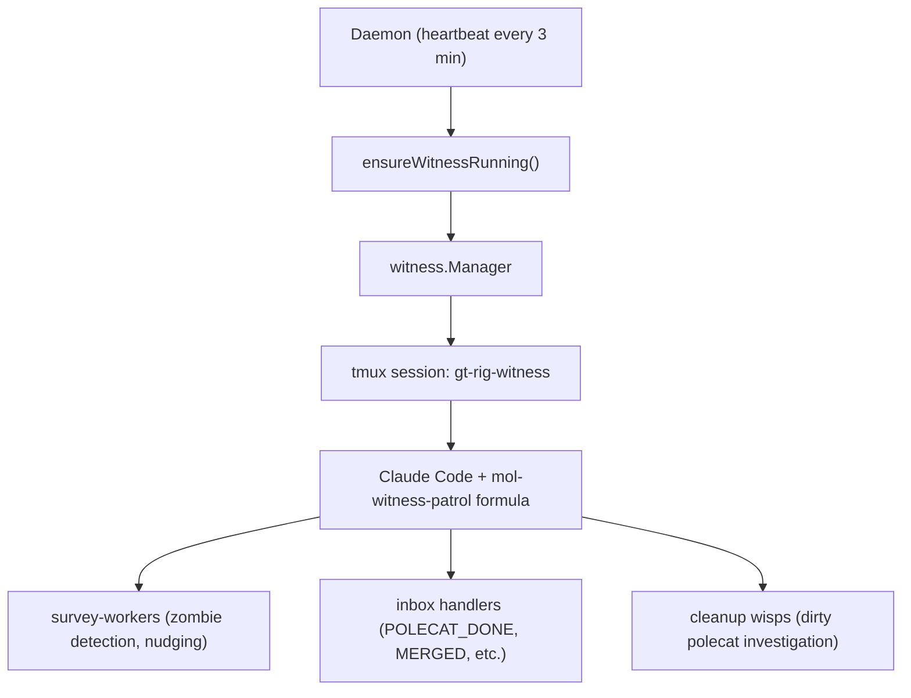

# Witness Patrol

> The polecat lifecycle manager. Monitors workers, detects zombies, handles
> completions, and keeps the rig's workforce healthy.

## The Patrol Loop

The Witness patrol is a formula-driven loop. Each iteration checks mail,
processes completed polecats, surveys active workers, and handles cleanup.
The entire loop runs as a wisp (ephemeral molecule).

## Step Breakdown

### inbox-check

Process incoming mail. The Witness handles five message types:

| Message | From | What happens |
|---------|------|-------------|
| `POLECAT_DONE` | Polecat | Auto-nuke if clean, escalate if dirty |
| `MERGED` | Refinery | Verify commit on main, then nuke polecat |
| `MERGE_FAILED` | Refinery | Notify polecat of failure for rework |
| `HELP` | Polecat | Assess request, escalate if needed |
| `SWARM_START` | Mayor | Create tracking wisp for batch work |

`POLECAT_DONE` triggers the most important signal flow: the Witness sends
`MERGE_READY` to the Refinery, then nudges the Refinery session to check its
inbox immediately. This keeps the merge queue responsive without polling.

### process-cleanups

Handle polecats that couldn't be auto-nuked. Each dirty polecat gets a cleanup
wisp — an ephemeral tracking bead that records what needs investigation.

| Cleanup state | Meaning | Action |
|---------------|---------|--------|
| `pending` | Needs investigation | Witness surveys, diagnoses problem |
| `merge-requested` | Waiting for MR merge | Track until Refinery resolves |
| `zombie-detected` | Session dead, work to recover | Escalate to Deacon |

### check-refinery

Verify the Refinery is healthy and the merge queue is flowing. If the Refinery
session is dead, wake it via mail. If the queue is backed up, note it for the
patrol summary.

### survey-workers

The core monitoring step. For each active polecat:

1. **List agent beads** (`bd list --type=agent --json`) to get state, hook, role
2. **Assess progress** by capturing recent tmux pane output
3. **Detect zombies** (see [Zombie Detection](#zombie-detection) below)
4. **Nudge if needed** based on idle duration:

| Idle time | Action |
|-----------|--------|
| 5-15 min | Gentle nudge |
| 15+ min | Direct nudge with deadline |
| Session dead | Zombie — nuke or escalate |

### check-timer-gates

Check for expired async wait gates. Timer gates have a creation time and
timeout; when elapsed, the Witness escalates them so the Deacon can dispatch
the gated molecule.

### check-swarm-completion

Track batch work progress. When a swarm (coordinated multi-polecat dispatch)
has all its polecats merged, notify the Mayor that the batch is complete.

## The Ephemeral Polecat Model

Polecats are designed to be short-lived. Their lifecycle is:

The key insight: once a polecat's branch is pushed and its MR bead is created,
the polecat itself has no more value. The MR lives independently in the merge
queue. The Refinery processes MRs, not polecats.

This separation means polecats can be aggressively cleaned up. A "clean" polecat
(no uncommitted work, branch pushed) is nuked immediately on `POLECAT_DONE`.
Only "dirty" polecats (unpushed commits, stashes, uncommitted changes) require
investigation before cleanup.

## Zombie Detection

The Witness detects four classes of zombie polecats:

| Type | Condition | Detection |
|------|-----------|-----------|
| **Session-dead** | Tmux session gone, agent_state still active | Cross-check tmux + beads |
| **Agent-dead** | Tmux alive, Claude process dead inside | `IsAgentAlive()` check |
| **Stuck-in-done** | Done-intent label >60s old, still alive | Parse done-intent timestamp |
| **Bead-closed** | Agent alive but hooked bead is closed | Check bead status |

### Auto-nuke safety

Before nuking any polecat, the Witness checks the `cleanup_status` field on the
agent's bead (self-reported by the polecat):

| Status | Action |
|--------|--------|
| `clean` | Safe to nuke immediately |
| `has_uncommitted` | Skip — work in progress |
| `has_stash` | Skip — needs review |
| `has_unpushed` | Escalate — prevent data loss |
| (none) | Fall back to `verifyCommitOnMain()` |

The fallback `verifyCommitOnMain()` checks all configured remotes to verify the
polecat's HEAD commit is an ancestor of the default branch. Only nukes if the
commit is confirmed on at least one remote.

### TOCTOU guard

Zombie detection records the detection timestamp before checking session
liveness. This prevents killing a newly-spawned session that reuses the same
tmux session name.

## Signal Flow

The Witness is the central message hub for polecat work:

Escalation flows upward:

## Discovery Over Tracking

The Witness follows a "zero-state" principle: it discovers reality each cycle
rather than maintaining persistent state.

- **Polecat list**: rebuilt from filesystem each cycle, not cached
- **Agent state**: read from beads database, not from memory
- **Session liveness**: checked via tmux, not via state files
- **Queue health**: queried from Refinery, not tracked locally

This means a Witness restart is seamless. The new session reads the same beads
and filesystem, arriving at the same conclusions as the previous session would
have.

## Architecture

The daemon ensures the Witness is always running. If the tmux session dies,
the next heartbeat restarts it. The new session picks up where the old one
left off because all state is in beads.

See [Patrols Overview](./overview.md) for the universal patrol lifecycle and
[Refinery Patrol](./refinery.md) for how the merge queue processes MRs that
the Witness routes to it.
