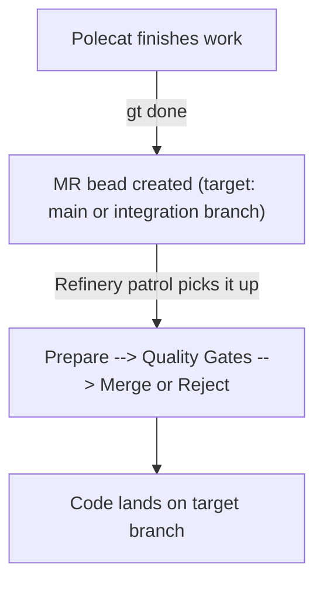
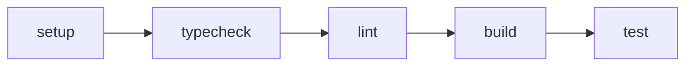
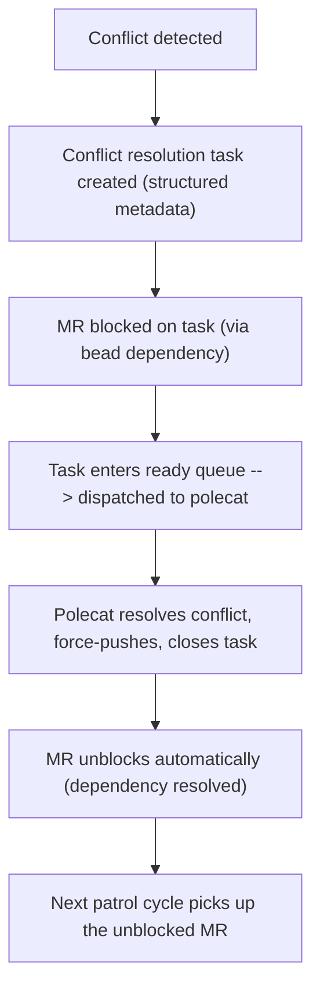
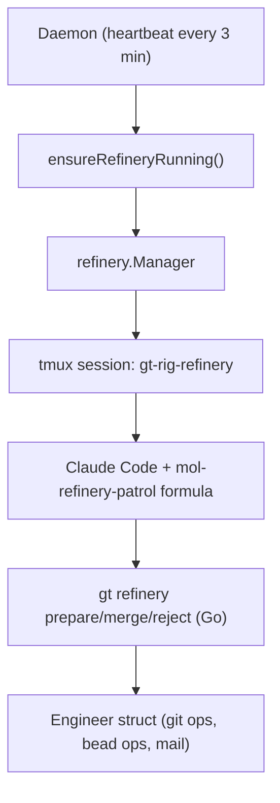

# Refinery (v2 — Proposed)

> Three-command merge pipeline. Replaces the formula-driven approach in
> [Refinery (current)](./refinery.md).

## Overview

The Refinery is a rig-level agent that processes merge requests. When a polecat
finishes work (`gt done` creates an MR bead), the Refinery picks it up, validates
it through quality gates, and merges it to the target branch. One Refinery per
rig, all code changes flow through it.

The Refinery is the bottleneck by design. A single, deterministic merge path
prevents race conditions, ensures quality gates run on rebased code, and keeps
the commit history clean.

## The Three-Command Pipeline

The Refinery's core work is split into three deterministic CLI commands. The
patrol formula orchestrates *when* to call them; the commands handle *how*.

### `gt refinery prepare`

Claims the next ready MR, rebases it onto the target branch, and runs quality
gates. Returns a structured exit code:

| Exit | Meaning | What happens |
|------|---------|-------------|
| 0 | Gates passed | Ready to merge |
| 1 | Conflict | Task created, MR blocked, merge slot acquired |
| 2 | Gate failed | Structured error output for diagnosis |
| 3 | Queue empty | Nothing to process |
| 4 | Infrastructure error | Transient failure, retry next cycle |

### `gt refinery merge <mr-id>`

Performs the actual merge: checkout target, fast-forward merge, push, verify,
then handle all post-merge bookkeeping (close MR bead, close source issue,
send MERGED notification, delete branch, sync crew workspaces).

### `gt refinery reject <mr-id> --reason "..."`

Reopens the source issue (so a new polecat can rework it), sends a MERGE_FAILED
notification, closes the MR bead as rejected, and cleans up the branch.

## The Design Principle

> **Go transports data, LLM decides what's interesting.**

Commands handle all git mechanics, bead state transitions, mail notifications,
and branch cleanup deterministically. The patrol formula handles orchestration
and one critical judgment call — the [diagnosis seam](./patrols/refinery.md#the-diagnosis-seam).

This split means the merge path works identically regardless of which model
runs the formula. The critical path (where bugs live) is in Go, not in prose.

## Quality Gates

Prepare runs a configurable gate pipeline before approving an MR:

Each gate is optional and configured per-rig in `config.json`. Gates run on the
**rebased feature branch** — the code as it would appear after merge, with all
target branch changes incorporated. This catches integration issues that
branch-only testing would miss.

## Conflict Resolution

When prepare detects a rebase conflict (exit code 1):

The blocking mechanism uses bead dependencies — the MR has a `blocks` dependency
on the conflict task. The `bd ready` query automatically excludes issues with open
blockers, so the MR doesn't re-enter the queue until the task is closed.

A merge slot is acquired before the conflict task is created. This prevents
multiple conflict tasks from being created for the same MR.

## Integration Branch Awareness

The Refinery handles two merge targets differently:

| Merge to... | Source issue | Behavior |
|-------------|-------------|----------|
| Default branch (main) | Closed | Work is complete |
| Integration branch | Left open | Work accumulates until epic lands |

When merging to an integration branch, the source issue stays open because
the work isn't truly "done" until the integration branch itself lands to main
(via `gt mq integration land`). This prevents premature issue closure for
epic-scoped work. See [Integration Branches](./integration-branches.md).

## Merge Strategy

The Refinery supports two merge strategies, configured per-rig:

| Strategy | How it works | When to use |
|----------|-------------|-------------|
| `rebase-ff` (default) | Rebase onto target, fast-forward merge | Clean linear history |
| `squash` | Squash all commits into one, merge to target | Condensed history |

Both strategies run quality gates on the rebased/squashed code before merging.
The strategy is set in the rig's `config.json` under `merge_queue.merge_strategy`.

## Architecture

The daemon ensures the Refinery is always running. If the tmux session dies
(crash, OOM, context exhaustion), the next heartbeat restarts it. The new
session picks up where the old one left off because all state is in beads.

See [Refinery Patrol v2](./patrols/refinery-v2.md) for how the formula drives
the patrol loop with the three-command pipeline.
