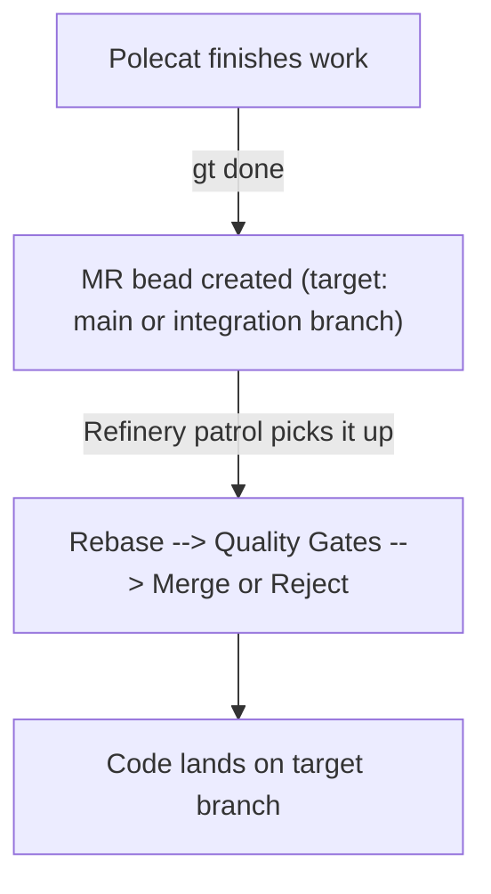
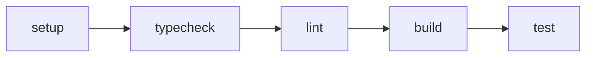
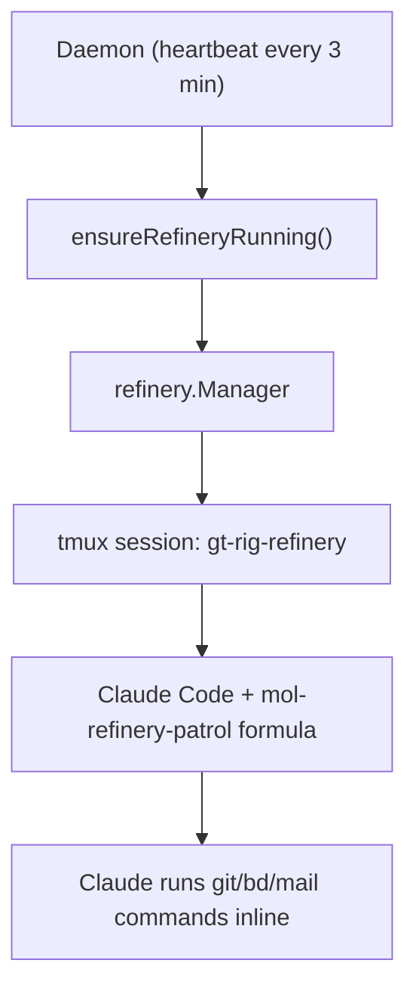

# Refinery

> The merge queue processor. Takes polecat work and lands it on target branches.

## Overview

The Refinery is a rig-level agent that processes merge requests. When a polecat
finishes work (`gt done` creates an MR bead), the Refinery picks it up, validates
it through quality gates, and merges it to the target branch. One Refinery per
rig, all code changes flow through it.

The Refinery is the bottleneck by design. A single merge path prevents race
conditions, ensures quality gates run on rebased code, and keeps the commit
history clean.

## Formula-Driven Merge

The Refinery patrol formula (`mol-refinery-patrol`) instructs Claude through
each merge step. The formula contains prose instructions; Claude executes git
commands, sends mail, and manages bead state inline.

The merge steps are:

1. **Mechanical rebase** — Claude checks out the branch and rebases onto the
   target. If conflicts arise, Claude creates a conflict resolution task.
2. **Quality gates** — Claude runs configured commands (setup, typecheck, lint,
   build, test) on the rebased branch.
3. **Handle failures** — If gates fail, Claude diagnoses whether the failure is
   a branch regression or pre-existing on the target.
4. **Merge and push** — Claude runs `git merge --ff-only` and `git push`, then
   sends MERGED notification, closes the MR bead, and cleans up the branch.

Each of these steps is described in formula prose that Claude follows. There are
no dedicated CLI commands for merge processing — Claude runs raw git commands
and `bd`/`gt mail` commands as instructed by the formula.

## Quality Gates

The formula runs a configurable gate pipeline before approving an MR:

Each gate is optional and configured per-rig via formula variables. Gates run
on the **rebased feature branch** — the code as it would appear after merge.

## Conflict Resolution

When a rebase conflict is detected, Claude:

1. Aborts the rebase (`git rebase --abort`)
2. Creates a conflict resolution task via `bd create`
3. Skips the MR and moves to the next one in the queue
4. The MR stays open and will be retried in a future cycle

## Integration Branch Awareness

The Refinery handles two merge targets differently:

| Merge to... | Source issue | Behavior |
|-------------|-------------|----------|
| Default branch (main) | Closed | Work is complete |
| Integration branch | Left open | Work accumulates until epic lands |

When merging to an integration branch, the source issue stays open because
the work isn't truly "done" until the integration branch itself lands to main
(via `gt mq integration land`). See [Integration Branches](./integration-branches.md).

## Merge Strategy

The formula uses `rebase` + `git merge --ff-only` for a linear commit history.

## Architecture

The Engineer struct in `internal/refinery/engineer.go` contains merge methods
(`doMerge`, `HandleMRInfoSuccess`, `HandleMRInfoFailure`, etc.) but these are
**not currently wired into any production code path**. The formula bypasses
the Engineer and has Claude execute merge steps directly.

See [Refinery Patrol](./patrols/refinery.md) for how the formula drives the
patrol loop.

## Known Issues

See [Refinery Issues](../issues/refinery.md) for a full list of known problems,
and [Refinery v2](./refinery-v2.md) for the proposed three-command pipeline
that addresses them.
