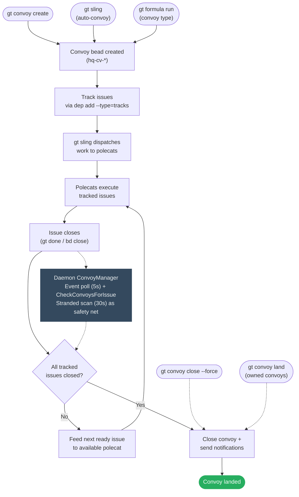

# Convoy Lifecycle Design

> Making convoys actively converge on completion.

## Flow



Three creation paths feed into the same lifecycle. Completion is event-driven
via the daemon's `ConvoyManager`, which runs two goroutines:

- **Event poll** (every 5s): Polls all rig beads stores + hq via
  `GetAllEventsSince`, detects close events, and calls
  `convoy.CheckConvoysForIssue` — which both checks completion *and* feeds
  the next ready issue to a polecat.
- **Stranded scan** (every 30s): Runs `gt convoy stranded --json` to catch
  convoys missed by the event-driven path (e.g. after crash/restart). Feeds
  ready work or auto-closes empty convoys.

Manual overrides (`close --force`, `land`) bypass the check entirely.

> **History**: Witness and Refinery observers were originally planned as
> redundant observers but were removed (spec S-04, S-05). The daemon's
> multi-rig event poll + stranded scan provide sufficient coverage.

---

## Problem Statement

Convoys are passive trackers. They group work but don't drive it. The completion
loop has a structural gap:

```
Create → Assign → Execute → Issues close → ??? → Convoy closes
```

The `???` is "Deacon patrol runs `gt convoy check`" - a poll-based single point of
failure. When Deacon is down, convoys don't close. Work completes but the loop
never lands.

## Current State

### What Works
- Convoy creation and issue tracking
- `gt convoy status` shows progress
- `gt convoy stranded` finds unassigned work
- `gt convoy check` auto-closes completed convoys

### What Breaks
1. **Poll-based completion**: Only Deacon runs `gt convoy check`
2. **No event-driven trigger**: Issue close doesn't propagate to convoy
3. **Manual close is inconsistent across docs**: `gt convoy close --force` exists, but some docs still describe it as missing
4. **Single observer**: No redundant completion detection
5. **Weak notification**: Convoy owner not always clear

## Design: Active Convoy Convergence

### Principle: Event-Driven, Redundantly Observed

Convoy completion should be:
1. **Event-driven**: Triggered by issue close, not polling
2. **Redundantly observed**: Multiple agents can detect and close
3. **Manually overridable**: Humans can force-close

### Event-Driven Completion

When an issue closes, check if it's tracked by a convoy:

```
Issue closes
    ↓
Is issue tracked by convoy? ──(no)──► done
    │
   (yes)
    ↓
Run gt convoy check <convoy-id>
    ↓
All tracked issues closed? ──(no)──► done
    │
   (yes)
    ↓
Close convoy, send notifications
```

**Implementation**: The daemon's `ConvoyManager` event poll detects close events
via SDK `GetAllEventsSince` across all rig stores + hq. This catches all closes
regardless of source (CLI, witness, refinery, manual).

### Observer: Daemon ConvoyManager

The daemon's `ConvoyManager` is the sole convoy observer, running two
independent goroutines:

| Loop | Trigger | What it does |
|------|---------|--------------|
| **Event poll** | `GetAllEventsSince` every 5s (all rig stores + hq) | Detects close events, calls `CheckConvoysForIssue` |
| **Stranded scan** | `gt convoy stranded --json` every 30s | Feeds first ready issue via `gt sling`, auto-closes empty convoys |

Both loops are context-cancellable. The shared `CheckConvoysForIssue` function
is idempotent — closing an already-closed convoy is a no-op.

> **History**: The original design called for three redundant observers (Daemon,
> Witness, Refinery) per the "Redundant Monitoring Is Resilience" principle.
> Witness observers were removed (spec S-04) because convoy tracking is
> orthogonal to polecat lifecycle management. Refinery observers were removed
> (spec S-05) after S-17 found they were silently broken (wrong root path) with
> no visible impact, confirming single-observer coverage is sufficient.

### Manual Close Command

`gt convoy close` is implemented, including `--force` for abandoned convoys.

```bash
# Close a completed convoy
gt convoy close hq-cv-abc

# Force-close an abandoned convoy
gt convoy close hq-cv-xyz --reason="work done differently"

# Close with explicit notification
gt convoy close hq-cv-abc --notify mayor/
```

Use cases:
- Abandoned convoys no longer relevant
- Work completed outside tracked path
- Force-closing stuck convoys

### Convoy Owner/Requester

Track who requested the convoy for targeted notifications:

```bash
gt convoy create "Feature X" gt-abc --owner mayor/ --notify overseer
```

| Field | Purpose |
|-------|---------|
| `owner` | Who requested (gets completion notification) |
| `notify` | Additional subscribers |

If `owner` not specified, defaults to creator (from `created_by`).

### Convoy States

```
OPEN ──(all issues close)──► CLOSED
  │                             │
  │                             ▼
  │                    (add issues)
  │                             │
  └─────────────────────────────┘
         (auto-reopens)
```

Adding issues to closed convoy reopens automatically.

**New state for abandonment:**

```
OPEN ──► CLOSED (completed)
  │
  └────► ABANDONED (force-closed without completion)
```

### Timeout/SLA (Future)

Optional `due_at` field for convoy deadline:

```bash
gt convoy create "Sprint work" gt-abc --due="2026-01-15"
```

Overdue convoys surface in `gt convoy stranded --overdue`.

## Commands

### Current: `gt convoy close`

```bash
gt convoy close <convoy-id> [--reason=<reason>] [--notify=<agent>]
```

- Verifies tracked issues are complete by default
- `--force` closes even when tracked issues remain open
- Sets `close_reason` field
- Sends notification to owner and subscribers
- Idempotent - closing closed convoy is no-op

### Enhanced: `gt convoy check`

```bash
# Check all convoys (current behavior)
gt convoy check

# Check specific convoy (new)
gt convoy check <convoy-id>

# Dry-run mode
gt convoy check --dry-run
```

### Future: `gt convoy reopen`

```bash
gt convoy reopen <convoy-id>
```

Explicit reopen for clarity (currently implicit via add).

## Implementation Status

Core convoy manager is fully implemented and tested (see [spec.md](spec.md)
stories S-01 through S-18, all DONE). Remaining future work:

1. **P2: Owner field** - targeted notifications polish
2. **P3: Timeout/SLA** - deadline tracking

## Key Files

| Component | File |
|-----------|------|
| Convoy command | `internal/cmd/convoy.go` |
| Auto-convoy (sling) | `internal/cmd/sling_convoy.go` |
| Event-driven observer | `internal/convoy/observer.go` (`CheckConvoysForIssue`, `feedNextReadyIssue`) |
| Daemon manager | `internal/daemon/convoy_manager.go` |
| Formula convoy | `internal/cmd/formula.go` (`executeConvoyFormula`) |

## Related

- [convoy.md](../../concepts/convoy.md) - Convoy concept and usage
- [watchdog-chain.md](../watchdog-chain.md) - Daemon/boot/deacon watchdog chain
- [mail-protocol.md](../mail-protocol.md) - Notification delivery
