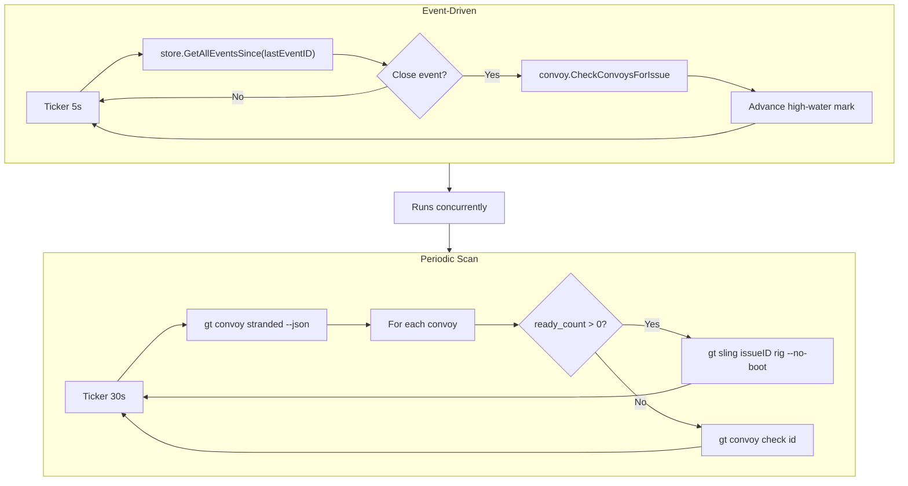

# Convoy Manager Flow

> Event-driven convoy completion/feeding and periodic stranded scan

---

## Flow

Runs as two goroutines inside `gt daemon`:

- **Event-driven**: Polls beads SDK `GetAllEventsSince` every 5 seconds, detects
  issue close events, and invokes `convoy.CheckConvoysForIssue` to check
  completion and feed the next ready issue. On poll errors it logs and retries
  on the next tick.

- **Periodic scan**: Every 30s, runs `gt convoy stranded --json`. For convoys with
  ready work, dispatches first issue via `gt sling`. For empty convoys, runs
  `gt convoy check` to auto-close. Catches stranded convoys (e.g. after crash)
  that the event poll path missed.

---

## Key Files

| Component | File |
|-----------|------|
| Manager implementation | `internal/daemon/convoy_manager.go` |
| Started by | `internal/daemon/daemon.go` (`Run`) |
