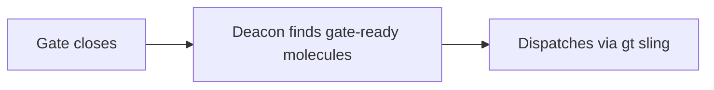
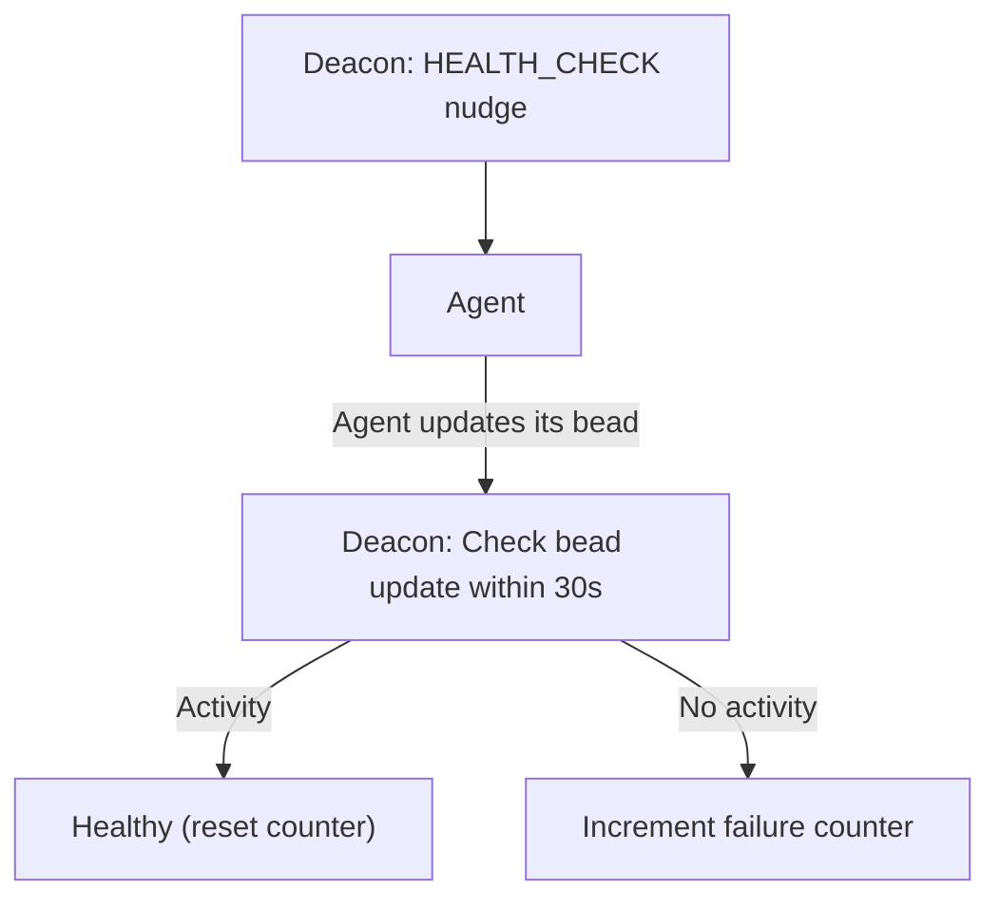

# Deacon Patrol Design

> Implementation decisions for town-wide orchestration, gate evaluation,
> health monitoring, and the idle town principle.

## Problem Statement

A multi-rig Gas Town needs a single coordinator that:

- Ensures Witnesses and Refineries are running across all rigs
- Dispatches work blocked on async events (gates)
- Manages cross-rig dependencies and convoys
- Maintains infrastructure (logs, wisps, orphan processes)

The Deacon is this coordinator — a town-level singleton running a continuous
patrol loop with 20+ steps.

## Design Decision: Formula-Driven, Not Go-Driven

The Deacon could have been a Go daemon (like the existing daemon process).
Instead, it's a Claude agent running a formula. Why?

1. **Health checks need intelligence** — Distinguishing "stuck agent" from
   "agent thinking deeply" requires observing tmux panes and reasoning about
   context. Go code can't do this.

2. **Escalation is nuanced** — When to restart vs nudge vs notify the human
   requires judgment. Hardcoded thresholds cause false positives.

3. **Cross-rig coordination** — Convoy completion, dependency resolution, and
   stranded work detection benefit from an agent that can reason about state.

4. **The daemon is still there** — The Go daemon runs the 3-minute heartbeat
   as a safety net. The Deacon is the brain; the daemon is the pacemaker.

### Why Not Merge with the Daemon?

The daemon is deliberately "dumb" — it follows ZFC (Zero-state Feedback
Compliance) and never reasons about agent state. This separation means:

- Daemon can never hang on an LLM call
- Daemon recovery is instant (restart the process)
- Deacon failures don't take down the heartbeat

## The Idle Town Principle

The Deacon's most important design principle: **silence when healthy and idle.**

| Town state | Deacon behavior |
|------------|----------------|
| Active work exists | Full monitoring: health checks, nudges, dispatch |
| No active work | Minimal: verify sessions exist, skip nudges |
| Nothing happening | Sleep with exponential backoff (up to 5 min) |

### Why This Matters

Early designs had the Deacon sending HEALTH_CHECK nudges every cycle regardless
of activity. This caused:

- **Context waste** — nudged agents process the nudge, consuming tokens
- **False urgency** — agents interpret nudges as "something is wrong"
- **Log noise** — health check mail pollutes inboxes

The idle town principle means a quiet town is truly quiet. The feed
subscription (`bd activity --follow`) wakes the Deacon on real events; the
daemon heartbeat is a 3-minute safety net for if the feed dies.

## Gate Evaluation

Gates are async coordination primitives. A molecule step creates a gate,
and the Deacon evaluates gates each cycle.

### Gate Types

| Type | Created by | Closed by |
|------|-----------|-----------|
| `timer` | Molecule step | Deacon: `CreatedAt + Timeout < Now` |
| `gh:run` | Polecat/workflow | Deacon: polls GitHub Actions status |
| `gh:pr` | Polecat/workflow | Deacon: polls PR merge/close status |
| `human` | Any step | Human: `bd gate approve <gate-id>` |
| `mail` | Any step | Subscription: message arrives |

### Evaluation Flow

```go
// Simplified gate evaluation (from patrol step 4)
gates := bd.ListGates(status: "open")
for _, gate := range gates {
    switch gate.Type {
    case "timer":
        if time.Since(gate.CreatedAt) > gate.Timeout {
            bd.CloseGate(gate.ID, "elapsed")
            notify(gate.Waiters)
        }
    case "gh:run":
        if gh.RunCompleted(gate.RunID) {
            bd.CloseGate(gate.ID, gh.RunResult(gate.RunID))
            notify(gate.Waiters)
        }
    // human and mail gates: skip (require external action)
    }
}
```

### Dispatch After Gate Close



The Deacon doesn't maintain a waiter list. It discovers reality each cycle:
if a gate is closed and a molecule is ready, it dispatches. No subscription
state to maintain or lose.

## Health Check Protocol

### Nudge-and-Wait Pattern



### Consecutive Failure Tracking

| Failures | Action |
|----------|--------|
| 1-2 | Log, retry next cycle |
| 3+ | Recommend force-kill |

Force-kill has a 5-minute cooldown to prevent crash loops.

### Design Choice: Nudge, Not Ping

The Deacon doesn't send explicit "are you alive?" messages. Instead, it nudges
the agent (injects text into the tmux session), which causes the agent to
process something and update its bead. This reuses the existing nudge
infrastructure and doesn't require a separate health check protocol.

## No Kill Authority

The Deacon detects zombies but does NOT kill them directly. Instead:

1. Deacon files a death warrant (bead with structured metadata)
2. Boot (ephemeral triage agent) processes the warrant
3. Boot interrogates the target session
4. Boot executes or pardons

### Why Not Let Deacon Kill Directly?

1. **TOCTOU risk** — between detection and kill, the session may have recovered
2. **Confirmation bias** — a long-running Deacon accumulates context that may
   lead to incorrect zombie diagnosis
3. **Fresh eyes** — Boot starts with zero context, observes the session from
   scratch, and makes an independent decision
4. **Audit trail** — warrants create a paper trail. Direct kills are invisible.

## Dog Pool Management

Dogs are reusable infrastructure workers. See
[Dog Pool Architecture](../dog-pool-architecture.md) for the full design.

The Deacon's patrol manages the pool with two steps:

**dog-pool-maintenance:**
- Ensure at least 1 idle dog exists
- Spawn on demand if pool empty
- Max 4 dogs total
- Optionally retire dogs idle >24 hours

**dog-health-check:**
- Detect dogs working longer than timeout
- File death warrant or force clear based on duration
- Track chronic failures per dog

## Cross-Rig Coordination

### Convoys

Convoys are town-level coordination beads that track multiple issues across
rigs. The Deacon manages them with two steps:

**check-convoy-completion** — `gt convoy check` auto-closes convoys where all
tracked issues are resolved.

**feed-stranded-convoys** — find convoys with ready issues but no workers.
Dispatch dogs to pick up stranded work.

### External Dependencies

When an issue closes in one rig, it may unblock issues in other rigs. The
Deacon checks the activity feed for closures, finds cross-rig dependents
via the `blocks` field, and sends notifications.

### Why Convoys Use `gt` Not `bd`

Convoys are stored in `hq-` prefixed beads (town-level). The `gt` commands
handle cross-rig routing automatically, while `bd` commands operate on the
local rig's beads. The Deacon always uses `gt convoy` for town-aware queries.

## The 24-Step Formula

The Deacon formula has ~24 steps — far more than the Witness (9) or
Refinery (10). This is by design:

1. **Town scope** — the Deacon covers ALL rigs, not just one
2. **Infrastructure breadth** — logs, wisps, orphans, branches, processes
3. **Async coordination** — gates, convoys, dependencies
4. **Monitoring** — health scans, zombie scans, dog health

### Step Ordering Rationale

Steps are ordered by priority:
1. **Mail first** — process callbacks before acting
2. **Infrastructure** — clean up before dispatching (prevent dispatching to dead sessions)
3. **Dispatch** — send work before monitoring (so monitoring sees fresh state)
4. **Monitoring** — health checks after dispatch (detect fresh issues)
5. **Housekeeping** — cleanup last (least urgent)

## Key Files

| Component | File |
|-----------|------|
| Deacon manager | `internal/deacon/manager.go` |
| Deacon commands | `internal/cmd/deacon.go` |
| Patrol formula | `internal/formula/formulas/mol-deacon-patrol.formula.toml` |
| Daemon heartbeat | `internal/daemon/daemon.go` |

## Related Design Docs

- [Watchdog Chain](../watchdog-chain.md) — Daemon → Boot → Deacon hierarchy
- [Dog Pool Architecture](../dog-pool-architecture.md) — dog lifecycle and dispatch
- [Escalation System](../escalation-system.md) — escalation routing and severity
- [Mail Protocol](../mail-protocol.md) — message types and routing
