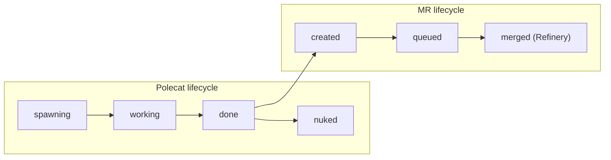
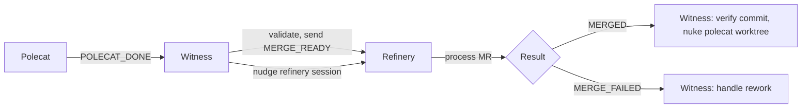

# Witness Patrol Design

> Implementation decisions for polecat lifecycle management, zombie detection,
> and the ephemeral worker model.

## Problem Statement

Polecats are transient AI workers. They spawn, do one task, push code, and
need to be cleaned up. Without active monitoring:

- Dead sessions accumulate (memory, tmux slots)
- Unpushed work gets lost when sessions die
- Merge queue stalls because nobody signals MERGE_READY
- Zombie polecats consume resources indefinitely

The Witness is the per-rig agent that solves these problems.

## Design Decision: Ephemeral Polecat Model

The key architectural insight: **once a polecat's branch is pushed, the polecat
has no value.** The MR lives independently in the merge queue.



This means:
- Polecats are aggressively cleaned up ("nuke early, nuke often")
- MR processing doesn't depend on the polecat being alive
- If a conflict arises during merge, the Refinery spawns a NEW polecat
- No polecat state needs to survive past `gt done`

### Why Not Keep Polecats Alive for Rework?

We considered keeping polecats alive until their MR merges, so they could
handle rework (conflicts, test failures). Rejected because:

1. **Resource waste** — idle polecats consume tmux sessions and memory
2. **Context bloat** — by the time rework is needed, the polecat's context
   is full of stale work from the original task
3. **Fresh is better** — a new polecat with a clean context and a focused
   conflict resolution formula produces better results than an old polecat
   trying to remember what it did

## Zombie Detection Algorithm

The Witness detects four classes of zombie polecats:

### Class 1: Session-Dead

```
Condition: tmux session gone + agent_state = working/running/spawning
Detection: Cross-check tmux session list against agent beads
Risk:      Work may be unpushed
```

**Algorithm:**
1. Check git state: `git status --porcelain`, `git log origin/main..HEAD`
2. If clean (no uncommitted, no unpushed): auto-nuke
3. If dirty: escalate to Deacon + create cleanup wisp

### Class 2: Agent-Dead

```
Condition: tmux session exists + Claude process dead inside
Detection: IsAgentAlive() → checks for running claude process
Risk:      Session is a shell, polecat stopped working
```

Always auto-nuke — the session is just an empty shell.

### Class 3: Stuck-in-Done

```
Condition: done-intent label >60s old + session still alive
Detection: Parse done-intent label timestamp
Risk:      gt done hung or failed partway through
```

The `done-intent` label is set by polecats when they begin `gt done`. If 60
seconds pass and the session is still alive, the done process is stuck.

### Class 4: Bead-Closed

```
Condition: Agent bead marked alive + hooked bead is closed
Detection: Check hooked bead status
Risk:      Polecat didn't notice its work was completed/closed externally
```

### TOCTOU Guard

Zombie detection has an inherent race: between detecting a zombie and acting
on it, the session might have been recreated. The guard:

1. Record detection timestamp before checking session liveness
2. Before nuking, verify the session hasn't been recreated since detection
3. If session is newer than detection → skip (not a zombie, just reused name)

```go
detectedAt := time.Now()
if !tmux.HasSession(name) {
    // ... zombie detected ...
    // Before nuke:
    if sessionCreatedAfter(name, detectedAt) {
        return // Session was recreated, not a zombie
    }
    nuke(name)
}
```

## Auto-Nuke Safety Protocol

The Witness reads `cleanup_status` from the polecat's agent bead (self-reported
by the polecat during `gt done`):

| Status | Action | Rationale |
|--------|--------|-----------|
| `clean` | Nuke immediately | All work pushed, safe to destroy |
| `has_uncommitted` | Skip | Work in progress, may be valuable |
| `has_stash` | Skip | Intentional save, needs review |
| `has_unpushed` | Escalate to Deacon | Critical — prevent data loss |
| (none) | Fall back to `verifyCommitOnMain()` | Legacy polecat, no self-report |

### verifyCommitOnMain() Fallback

When no `cleanup_status` is available, the Witness checks whether the
polecat's HEAD commit exists on the remote default branch:

```go
func verifyCommitOnMain(polecatPath string) bool {
    sha := getHEAD(polecatPath)
    for _, remote := range configuredRemotes() {
        if isAncestorOf(sha, remote+"/"+defaultBranch) {
            return true  // Safe to nuke
        }
    }
    return false  // Not on remote — escalate
}
```

This handles multi-remote setups (e.g., fork + upstream) by checking ALL
configured remotes.

## Signal Flow Design

### Why Witness Sends MERGE_READY (Not Polecat)

The polecat could send MERGE_READY directly to the Refinery, but the Witness
intermediary provides:

1. **Validation** — Witness verifies the polecat is actually clean before
   signaling the Refinery
2. **Nudging** — Witness nudges the Refinery session to check its inbox
   immediately, reducing merge latency
3. **Tracking** — Witness records that MERGE_READY was sent, enabling
   correlation when MERGED/MERGE_FAILED arrives

### Signal Path



## Cleanup Wisp Lifecycle

When a polecat can't be auto-nuked, the Witness creates a cleanup wisp:

| State | Trigger | Witness action |
|-------|---------|---------------|
| `pending` | Dirty polecat detected | Investigate git state, assess recovery |
| `merge-requested` | POLECAT_DONE with pending MR | Track until Refinery resolves |
| `zombie-detected` | Session dead, work unrecoverable | Escalate to Deacon |

Cleanup wisps are ephemeral beads — they're squashed into the patrol digest
at the end of the cycle. They exist to give the Witness a structured tracking
mechanism during the cycle, not as permanent records.

## Discovery Over Tracking

The Witness follows Zero-state Feedback Compliance (ZFC):

| What | How discovered | NOT how |
|------|---------------|---------|
| Polecat list | Filesystem scan | Persistent list |
| Agent state | Beads database query | In-memory cache |
| Session liveness | tmux session check | State file |
| Git state | `git status` / `git log` | Cached status |

This means every Witness cycle starts from ground truth. If the Witness
crashes and restarts, it arrives at the same conclusions the previous
session would have — there's no lost tracking state.

## Key Files

| Component | File |
|-----------|------|
| Witness manager | `internal/witness/manager.go` |
| Protocol handlers | `internal/witness/handlers.go` |
| Zombie detection | `internal/witness/handlers.go` (`DetectZombiePolecats`) |
| Patrol formula | `internal/formula/formulas/mol-witness-patrol.formula.toml` |
| Witness commands | `internal/cmd/witness.go` |

## Related Design Docs

- [Watchdog Chain](../watchdog-chain.md) — how the Deacon monitors the Witness
- [Dog Pool Architecture](../dog-pool-architecture.md) — dogs used for cleanup escalation
- [Escalation System](../escalation-system.md) — how Witness escalates to Deacon/Mayor
