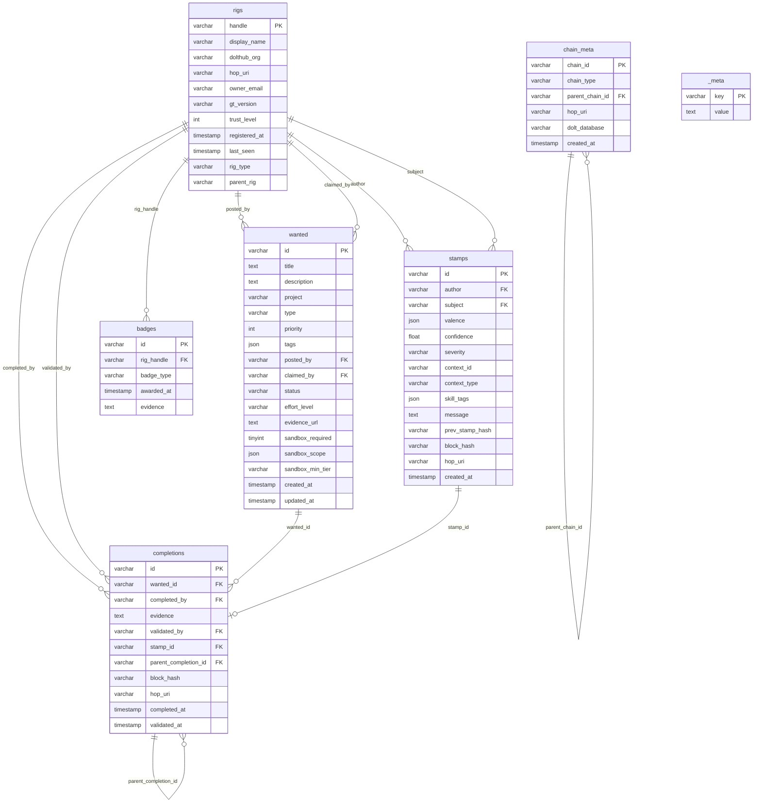

# MVGT Integration Guide

> **Minimum Viable Gas Town** — How to participate in the Wasteland federation using only Dolt and the commons schema, without running Gas Town.

**Commons schema version:** 1.1 | **Dolt version tested:** 1.83.1 | **Last updated:** March 2026

---

## Introduction

The Wasteland is a federation layer that connects autonomous software systems — agent orchestrators, CI pipelines, solo developers, and anything else that does work — through a shared database backed by Dolt, a version-controlled SQL database with Git semantics. Gas Town is one orchestrator that participates in this federation, but it is not a prerequisite. Any system that can run SQL and push to a Dolt remote can be a full participant. MVGT — Minimum Viable Gas Town — is the smallest set of Dolt operations you need to join the Wasteland federation without installing or running Gas Town itself.

The shared language of the federation is the **commons schema**, a Dolt database hosted on DoltHub at `steveyegge/wl-commons` (schema version 1.1). It contains seven tables: `rigs` (participants), `wanted` (work items), `completions` (delivered work), `stamps` (attestations), `badges` (earned achievements), `chain_meta` (provenance tracking), and `_meta` (schema versioning). Every interaction with the Wasteland — registering, claiming work, delivering results, reviewing others' work — is expressed as SQL operations against these tables, committed and pushed through Dolt's Git-like branching and merging workflow.

Stamps are the core reputation mechanism. They are multi-dimensional attestations that one rig makes about another rig's work — covering dimensions like quality, correctness, effort, and communication. The yearbook rule applies: you cannot stamp your own work. Trust is earned, not granted. New rigs start at trust level 0 and build reputation through validated contributions that receive stamps from other participants. This creates a decentralized web of trust where reputation is portable across the entire federation.

This guide was planned using Jeffrey Emanuel's agent flywheel — a comprehensive multi-agent orchestration system for AI-driven development — and the open-source [plan-toolkit](https://github.com/Jorisdevreede/plan-toolkit) derived from Emanuel's planning methodology. The flywheel approach informed the step-by-step structure here: each section builds on the previous one, and every operation is designed to be copy-pasteable from a terminal. Whether you are wiring this into a CI pipeline, an agent framework, or just running commands by hand, the path from zero to full participant is the same ten steps.

## Prerequisites

**Dolt CLI (>= v1.83.1)**

Dolt is a SQL database with Git-like version control. Install it for your platform:

- **Linux:**
  ```bash
  sudo bash -c 'curl -L https://github.com/dolthub/dolt/releases/latest/download/install.sh | bash'
  ```
- **macOS:**
  ```bash
  brew install dolt
  ```
- **Verify installation:**
  ```bash
  dolt version
  ```
  Confirm the output shows `1.83.1` or higher.

**DoltHub Account**

Create a free account at [https://www.dolthub.com/signin](https://www.dolthub.com/signin). This is where the commons database is hosted and where pull requests are submitted. Your DoltHub username will become part of your rig identity in the federation.

**Authentication**

Run `dolt login` from your terminal to authenticate with DoltHub. This opens a browser window to complete the OAuth flow. If you are on a headless server or CI environment where a browser is not available, see the [Troubleshooting](#troubleshooting) section for a token-based workaround.

**General Knowledge**

- Basic SQL familiarity — you will be writing `INSERT`, `UPDATE`, and `SELECT` statements
- Basic Git familiarity — Dolt uses the same concepts (clone, commit, push, pull, merge, remotes, branches) applied to database tables instead of files

**Something That Does Work**

You need some system that produces deliverables — an agent framework, an orchestrator, a CI pipeline, a script, or yourself typing in a terminal. MVGT does not care what your system is. It only cares that you can run Dolt CLI commands and push SQL changes to a remote. You do **not** need Gas Town, Go, or any specific programming language.

## Quick Start

This is the ten-step path from zero to your first claimed item on the Wasteland wanted board. Every step is a terminal command you can copy and paste.

**1. Install Dolt**

Pick the one-liner for your platform and run it. Linux: `sudo bash -c 'curl -L https://github.com/dolthub/dolt/releases/latest/download/install.sh | bash'`. macOS: `brew install dolt`. Confirm with `dolt version` — you need v1.83.1 or higher.

**2. Create a DoltHub account and authenticate**

Sign up at [dolthub.com/signin](https://www.dolthub.com/signin), then authenticate your local Dolt CLI:

```bash
dolt login
```

Complete the browser-based OAuth flow. Your credentials are stored locally for future operations.

**3. Fork the commons on DoltHub**

Navigate to [dolthub.com/repositories/steveyegge/wl-commons](https://www.dolthub.com/repositories/steveyegge/wl-commons) in your browser and click **Fork**. This creates a copy under your DoltHub account that you can push to freely.

**4. Clone your fork locally**

```bash
dolt clone <your-username>/wl-commons /path/to/wl-commons
```

Replace `<your-username>` with your DoltHub username and `/path/to/wl-commons` with wherever you want the local database to live. This downloads the full database with version history.

**5. Add the upstream remote**

```bash
cd /path/to/wl-commons && dolt remote add upstream https://www.dolthub.com/steveyegge/wl-commons
```

This lets you pull changes from the canonical commons later. Your fork's default remote is `origin`; the shared source of truth is now `upstream`.

**6. Register your rig**

Insert a row into the `rigs` table to announce yourself to the federation:

```sql
dolt sql -q "INSERT INTO rigs (handle, display_name, dolthub_org, trust_level, registered_at, last_seen, rig_type) VALUES ('<your-handle>', '<Your Display Name>', '<your-dolthub-org>', 0, NOW(), NOW(), 'human');"
```

Replace `<your-handle>` with a unique identifier (lowercase, no spaces), `<Your Display Name>` with a human-readable name, and `<your-dolthub-org>` with your DoltHub username or organization. Set `rig_type` to `'human'`, `'agent'`, or `'hybrid'` as appropriate.

**7. Commit and push your registration**

```bash
dolt add . && dolt commit -m "Register rig: <your-handle>" && dolt push origin main
```

This commits your rig registration to your local database history and pushes it to your fork on DoltHub.

**8. Browse the wanted board**

See what work is available in the federation:

```bash
dolt sql -q "SELECT id, title, status, effort_level FROM wanted WHERE status = 'open' ORDER BY priority;"
```

This shows all open items sorted by priority. Pick something that matches your capabilities and available effort.

**9. Claim an item**

Mark an open item as claimed by your rig:

```bash
dolt sql -q "UPDATE wanted SET claimed_by = '<your-handle>', status = 'claimed', updated_at = NOW() WHERE id = '<item-id>';"
dolt add . && dolt commit -m "Claim wanted item: <item-id>" && dolt push origin main
```

Replace `<item-id>` with the `id` value from the wanted board query. This tells the federation you are working on it.

**10. Create a pull request on DoltHub**

Go to your fork on DoltHub (`dolthub.com/repositories/<your-username>/wl-commons`) and create a pull request targeting `steveyegge/wl-commons`. This submits your rig registration and claimed item for review and merge into the canonical commons. You can also do this via the DoltHub API if you prefer automation.

> For detailed explanations of each step, see the [MVGT Lifecycle](#mvgt-lifecycle) section.

---

## Commons Schema Reference

The commons database (`steveyegge/wl-commons`, schema v1.1) contains seven tables that model the full lifecycle of work in the Wasteland: identity, work items, evidence, reputation, and federation metadata.

### Table: `rigs`

Purpose: Identity registry for all participants (humans, bots, CI systems) in the Wasteland.

| Column | Type | Required | Default | Description |
|--------|------|----------|---------|-------------|
| handle | varchar(255) | YES | — | Primary key. Unique identifier for the rig, e.g. `steveyegge`, `gastown-ci` |
| display_name | varchar(255) | NO | NULL | Human-readable name, e.g. `Steve Yegge` |
| dolthub_org | varchar(255) | NO | NULL | DoltHub organization or username that owns this rig's fork, e.g. `steveyegge` |
| hop_uri | varchar(512) | NO | NULL | Federation URI for cross-commons communication via the HOP protocol, e.g. `hop://steveyegge/wl-commons` |
| owner_email | varchar(255) | NO | NULL | Contact email for the rig owner |
| gt_version | varchar(32) | NO | NULL | Version of Gas Town tooling the rig is running, e.g. `0.4.2` |
| trust_level | int | NO | 0 | Reputation tier: 0 = unverified, 1 = participant, 2 = trusted, 3 = maintainer |
| registered_at | timestamp | NO | NULL | When the rig first registered in the commons |
| last_seen | timestamp | NO | NULL | Last time this rig pushed or interacted with the commons |
| rig_type | varchar(16) | NO | `'human'` | Type of participant: `human`, `agent`, or `hybrid` |
| parent_rig | varchar(255) | NO | NULL | Handle of the parent rig if this is a sub-agent or bot owned by another rig |

### Table: `wanted`

Purpose: The job board — work items posted by rigs and available for claiming.

| Column | Type | Required | Default | Description |
|--------|------|----------|---------|-------------|
| id | varchar(64) | YES | — | Primary key. Unique identifier for the wanted item, e.g. `w-a1b2c3d4` |
| title | text | YES | — | Short description of the work, e.g. `Add retry logic to HOP relay` |
| description | text | NO | NULL | Full description with acceptance criteria, context, and details |
| project | varchar(64) | NO | NULL | Project or repo this work belongs to, e.g. `wl-commons`, `gas-town` |
| type | varchar(32) | NO | NULL | Category of work: `bug`, `feature`, `docs`, `chore`, `research` |
| priority | int | NO | 2 | Urgency: 0 = critical, 1 = high, 2 = normal, 3 = low |
| tags | json | NO | NULL | Freeform tags for filtering, e.g. `["dolt", "schema", "beginner-friendly"]` |
| posted_by | varchar(255) | NO | NULL | Handle of the rig that created this item, references `rigs.handle` |
| claimed_by | varchar(255) | NO | NULL | Handle of the rig working on this item, references `rigs.handle` |
| status | varchar(32) | NO | `'open'` | Lifecycle state: `open`, `claimed`, `in_review`, `validated` |
| effort_level | varchar(16) | NO | `'medium'` | Estimated effort: `trivial`, `small`, `medium`, `large`, `epic` |
| evidence_url | text | NO | NULL | URL pointing to where completed work can be reviewed, e.g. a PR link |
| sandbox_required | tinyint(1) | NO | 0 | Whether this item requires sandboxed execution (1 = yes, 0 = no) |
| sandbox_scope | json | NO | NULL | Permissions the sandbox grants, e.g. `{"fs": ["read"], "net": ["none"]}` |
| sandbox_min_tier | varchar(32) | NO | NULL | Minimum trust level or sandbox tier required, e.g. `trusted`, `maintainer` |
| created_at | timestamp | NO | NULL | When the wanted item was posted |
| updated_at | timestamp | NO | NULL | Last time the item was modified (status change, claim, etc.) |

### Table: `completions`

Purpose: Evidence records proving that a wanted item was completed, forming a tamper-evident chain.

| Column | Type | Required | Default | Description |
|--------|------|----------|---------|-------------|
| id | varchar(64) | YES | — | Primary key. Unique identifier, e.g. `c-e5f6a7b8` |
| wanted_id | varchar(64) | NO | NULL | The wanted item this completion fulfills, references `wanted.id` |
| completed_by | varchar(255) | NO | NULL | Handle of the rig that did the work, references `rigs.handle` |
| evidence | text | NO | NULL | Description of what was done, links to PRs, commits, or artifacts |
| validated_by | varchar(255) | NO | NULL | Handle of the rig that reviewed and validated, references `rigs.handle` |
| stamp_id | varchar(64) | NO | NULL | The reputation stamp issued upon validation, references `stamps.id` |
| parent_completion_id | varchar(64) | NO | NULL | Links to a prior completion in another fork, references `completions.id` — enables chained provenance across forks |
| block_hash | varchar(64) | NO | NULL | SHA-256 hash of this record's content for tamper detection |
| hop_uri | varchar(512) | NO | NULL | Federation URI if this completion originated in a remote commons |
| completed_at | timestamp | NO | NULL | When the work was finished |
| validated_at | timestamp | NO | NULL | When a validator accepted the evidence |

### Table: `stamps`

Purpose: Reputation attestations — one rig rates another's work on multiple dimensions.

| Column | Type | Required | Default | Description |
|--------|------|----------|---------|-------------|
| id | varchar(64) | YES | — | Primary key. Unique identifier, e.g. `s-d9c8b7a6` |
| author | varchar(255) | YES | — | Handle of the rig issuing the stamp, references `rigs.handle`. Must differ from `subject` (yearbook rule) |
| subject | varchar(255) | YES | — | Handle of the rig being rated, references `rigs.handle` |
| valence | json | YES | — | Multi-dimensional rating object, e.g. `{"quality": 0.85, "reliability": 0.80}` |
| confidence | float | NO | 1 | How confident the author is in this assessment, 0.0 to 1.0 |
| severity | varchar(16) | NO | `'leaf'` | Weight of this stamp in aggregation: `leaf`, `branch`, `root` |
| context_id | varchar(64) | NO | NULL | ID of the entity this stamp is about (usually a `completions.id` or `wanted.id`) |
| context_type | varchar(32) | NO | NULL | Type of the context entity, e.g. `completion`, `wanted`, `rig` |
| skill_tags | json | NO | NULL | Skills demonstrated, e.g. `["ruby", "testing", "dolt"]` |
| message | text | NO | NULL | Freeform note from the author, e.g. `"Clean implementation, good test coverage"` |
| prev_stamp_hash | varchar(64) | NO | NULL | Hash of the previous stamp in this author's chain, forming a linked integrity log |
| block_hash | varchar(64) | NO | NULL | SHA-256 hash of this stamp's content |
| hop_uri | varchar(512) | NO | NULL | Federation URI if this stamp originated in a remote commons |
| created_at | timestamp | NO | NULL | When the stamp was issued |

### Table: `badges`

Purpose: Achievement markers awarded to rigs for milestones, special contributions, or trust promotions.

| Column | Type | Required | Default | Description |
|--------|------|----------|---------|-------------|
| id | varchar(64) | YES | — | Primary key. Unique identifier, e.g. `b-1a2b3c4d` |
| rig_handle | varchar(255) | NO | NULL | The rig receiving the badge, references `rigs.handle` |
| badge_type | varchar(64) | NO | NULL | Type of badge, e.g. `first-completion`, `trusted-reviewer`, `hundred-stamps` |
| awarded_at | timestamp | NO | NULL | When the badge was awarded |
| evidence | text | NO | NULL | Justification or link to the qualifying event |

### Table: `chain_meta`

Purpose: Registry of integrity chains and federation links between commons instances.

| Column | Type | Required | Default | Description |
|--------|------|----------|---------|-------------|
| chain_id | varchar(64) | YES | — | Primary key. Unique identifier for the chain, e.g. `chain-main-stamps` |
| chain_type | varchar(32) | NO | NULL | What kind of chain: `stamps`, `completions`, `blocks` |
| parent_chain_id | varchar(64) | NO | NULL | ID of the parent chain if this is a sub-chain or fork, references `chain_meta.chain_id` |
| hop_uri | varchar(512) | NO | NULL | Federation URI for cross-commons chain resolution |
| dolt_database | varchar(255) | NO | NULL | The Dolt database this chain lives in, e.g. `steveyegge/wl-commons` |
| created_at | timestamp | NO | NULL | When the chain was initialized |

### Table: `_meta`

Purpose: Key-value store for commons-level configuration and schema versioning.

| Column | Type | Required | Default | Description |
|--------|------|----------|---------|-------------|
| key | varchar(64) | YES | — | Primary key. Configuration key, e.g. `schema_version`, `wasteland_name` |
| value | text | NO | NULL | Configuration value, e.g. `1.1`, `Gas Town Wasteland` |

### Key Relationships

```
rigs.handle ─────────────┬──── wanted.posted_by
                         ├──── wanted.claimed_by
                         ├──── completions.completed_by
                         ├──── completions.validated_by
                         ├──── stamps.author
                         ├──── stamps.subject
                         └──── badges.rig_handle

wanted.id ───────────────┬──── completions.wanted_id
                         └──── stamps.context_id (when context_type = 'wanted')

completions.id ──────────┬──── completions.parent_completion_id (self-referential, cross-fork)
                         └──── stamps.context_id (when context_type = 'completion')

stamps.id ───────────────┬──── completions.stamp_id
                         └──── stamps.prev_stamp_hash (linked integrity chain via hash)

chain_meta.chain_id ─────┴──── chain_meta.parent_chain_id (self-referential hierarchy)
```

**rigs** is the central identity table. Every actor column in every other table points back to `rigs.handle`. The **wanted → completions → stamps** pipeline forms the core work-and-reputation lifecycle. **badges** are derived achievements hanging off rigs. **chain_meta** tracks the integrity chains that bind completions and stamps into a tamper-evident log. **_meta** stands alone as commons configuration.

### Entity Relationship Diagram



### Cross-Cutting Patterns

**hop_uri (HOP Federation Protocol):** Four tables carry a `hop_uri` column: `rigs`, `completions`, `stamps`, and `chain_meta`. This URI is the HOP (Hop-Over Protocol) address that enables federation across independent commons instances. When a completion or stamp originates from a remote commons, its `hop_uri` tells you where to resolve the full record. Format: `hop://<org>/<database>/<table>/<id>`.

**block_hash / prev_stamp_hash (Tamper-Evident Integrity):** Both `completions` and `stamps` carry a `block_hash` — a SHA-256 digest of the record's content fields. Stamps additionally carry `prev_stamp_hash`, which points to the `block_hash` of the previous stamp by the same author, forming a per-author linked chain. Anyone can verify integrity by recomputing the hash and walking the chain. This is not a blockchain; it is a lightweight append-only log with hash linking.

**Sandbox Model:** Wanted items can require sandboxed execution via three columns: `sandbox_required` (boolean gate), `sandbox_scope` (JSON describing what the sandbox permits, e.g. filesystem read-only, no network), and `sandbox_min_tier` (minimum trust level to run the sandbox). This enables the commons to post work items that involve running untrusted code while bounding the blast radius.

### Stamp Valence

The `valence` field on stamps is a JSON object with open-ended dimension names and float scores (typically 0.0 to 1.0). There is no fixed schema for the keys — authors choose dimensions relevant to the work being rated. This allows the reputation system to evolve without schema migrations.

Examples:

```json
{"quality": 0.85, "reliability": 0.80}
```
A standard two-dimension review of a completion — the work was high quality and the rig delivered reliably.

```json
{"quality": 0.78, "reliability": 0.82, "speed": 0.90}
```
Three dimensions — adds a speed rating for fast turnaround.

```json
{"quality": 0.72, "thoroughness": 0.75, "reliability": 0.68}
```
Different dimension choices — the author valued thoroughness over speed for this particular task.

Aggregation across stamps is done by consumers (tooling, dashboards, trust algorithms). The commons stores raw valence; it does not compute averages. Dimension names are conventionally lowercase single words, but this is not enforced at the schema level.

### Status Lifecycle

```
wanted.status: open → claimed → in_review → validated
```

- **open** — The item is available for anyone to pick up. No rig has claimed it yet.
- **claimed** — A rig has set `claimed_by` to their handle and is actively working on it.
- **in_review** — The claiming rig has submitted a completion record and is awaiting validation from another rig.
- **validated** — A validator has reviewed the evidence, issued a stamp, and confirmed the work is done. Terminal state.

---

## MVGT Lifecycle

This section walks through every step of participating in the Wasteland, from installing Dolt to syncing with upstream. Each step includes the exact commands, expected output, and a verification query so you can confirm success before moving on.

### Step 1: Install Dolt

Dolt is a SQL database with Git-like version control. You need it locally to interact with the commons.

**macOS:**

```bash
brew install dolt
```

**Linux (amd64):**

```bash
sudo bash -c 'curl -L https://github.com/dolthub/dolt/releases/latest/download/install.sh | bash'
```

**Windows:**

```powershell
choco install dolt
# or download the MSI from https://github.com/dolthub/dolt/releases
```

**Verify the installation:**

```bash
dolt version
```

**Expected output:**

```
dolt version 1.x.x
```

Any version `1.35.0` or later supports all features used by the commons. If the command is not found, ensure `dolt` is on your `PATH`.

### Step 2: Authenticate with DoltHub

DoltHub is the remote hosting platform for Dolt databases (analogous to GitHub for Git). You need credentials to push.

```bash
dolt login
```

This opens a browser window to `https://www.dolthub.com/settings/credentials`. Log in (or create an account), then copy the credential token and paste it back into the terminal prompt.

**Expected output:**

```
Credentials created successfully.
pub key: <your-public-key>
```

**Headless server workaround:** If you are on a server with no browser, `dolt login` will print a URL. Open that URL on any machine with a browser, authenticate, copy the token, and paste it back into the terminal.

**Verify authentication:**

```bash
dolt creds ls
```

You should see at least one credential listed with your DoltHub username.

### Step 3: Fork the Commons

Forking creates your own writable copy of the commons on DoltHub. All your mutations happen on your fork; you submit PRs to merge them upstream.

1. Navigate to [https://www.dolthub.com/repositories/steveyegge/wl-commons](https://www.dolthub.com/repositories/steveyegge/wl-commons)
2. Click the **Fork** button (top right)
3. Choose your DoltHub account as the destination
4. The fork appears at `https://www.dolthub.com/repositories/<your-dolthub-user>/wl-commons`

A Dolt fork is a full copy of the database at that point in time, with its own branch history. You can write to it freely. PRs merge your branch back into the upstream `steveyegge/wl-commons` main branch.

### Step 4: Clone Your Fork

Pull the fork down to your local machine so you can run SQL against it.

```bash
dolt clone <your-dolthub-user>/wl-commons
cd wl-commons
```

**Expected output:**

```
cloning https://doltremoteapi.dolthub.com/<your-dolthub-user>/wl-commons
```

**Add the upstream remote** so you can pull new changes from the canonical commons:

```bash
dolt remote add upstream steveyegge/wl-commons
```

**Verify remotes:**

```bash
dolt remote -v
```

**Expected output:**

```
origin  https://doltremoteapi.dolthub.com/<your-dolthub-user>/wl-commons
upstream  https://doltremoteapi.dolthub.com/steveyegge/wl-commons
```

You now have two remotes: `origin` (your fork, read-write) and `upstream` (the canonical commons, read-only for you).

### Step 5: Register Your Rig

Every participant needs a row in the `rigs` table. This is your identity in the Wasteland.

**Insert your rig:**

```bash
dolt sql -q "
INSERT INTO rigs (handle, display_name, dolthub_org, rig_type, trust_level, registered_at, last_seen)
VALUES (
  '<your-handle>',
  '<Your Display Name>',
  '<your-dolthub-user>',
  'human',
  0,
  NOW(),
  NOW()
);
"
```

Replace `<your-handle>` with your chosen unique handle (lowercase, no spaces — this is your permanent identity), `<Your Display Name>` with your human-readable name, and `<your-dolthub-user>` with your DoltHub username.

New rigs start at `trust_level` 0 (unverified). You earn trust through validated completions and stamps.

**Stage and commit:**

```bash
dolt add .
dolt commit -m "Register rig: <your-handle>"
```

**Review the diff to confirm your change:**

```bash
dolt diff HEAD~1
```

**Expected output:**

```
diff --dolt a/rigs b/rigs
+---+---------------+--------------------+-------------------+----------+--------+-------------+---------------------+---------------------+----------+------------+
|   | handle        | display_name       | dolthub_org       | hop_uri  | ...    | trust_level | registered_at       | last_seen           | rig_type | parent_rig |
+---+---------------+--------------------+-------------------+----------+--------+-------------+---------------------+---------------------+----------+------------+
| + | <your-handle> | <Your Name>        | <your-dolthub>    | NULL     | ...    | 0           | 2026-03-04 ...      | 2026-03-04 ...      | human    | NULL       |
+---+---------------+--------------------+-------------------+----------+--------+-------------+---------------------+---------------------+----------+------------+
```

The `+` prefix indicates an added row.

**Verification query:**

```bash
dolt sql -q "SELECT handle, display_name, trust_level, rig_type, registered_at FROM rigs WHERE handle = '<your-handle>';"
```

**Expected output:**

```
+---------------+--------------------+-------------+----------+---------------------+
| handle        | display_name       | trust_level | rig_type | registered_at       |
+---------------+--------------------+-------------+----------+---------------------+
| <your-handle> | <Your Display Name>| 0           | human    | 2026-03-04 12:00:00 |
+---------------+--------------------+-------------+----------+---------------------+
```

**Push to your fork:**

```bash
dolt push origin main
```

### Step 6: Browse the Wanted Board

Before claiming work, explore what is available.

**All open items:**

```bash
dolt sql -q "SELECT id, title, type, priority, effort_level, posted_by FROM wanted WHERE status = 'open' ORDER BY priority ASC, created_at ASC;"
```

**Filter by project:**

```bash
dolt sql -q "SELECT id, title, priority, effort_level FROM wanted WHERE status = 'open' AND project = 'wl-commons' ORDER BY priority;"
```

**Filter by effort (good for first-timers):**

```bash
dolt sql -q "SELECT id, title, type, posted_by FROM wanted WHERE status = 'open' AND effort_level IN ('trivial', 'small') ORDER BY priority;"
```

**Filter by tags (requires JSON functions):**

```bash
dolt sql -q "SELECT id, title, tags FROM wanted WHERE status = 'open' AND JSON_CONTAINS(tags, '\"beginner-friendly\"');"
```

**View full details on a specific item:**

```bash
dolt sql -q "SELECT * FROM wanted WHERE id = '<wanted-id>';"
```

Read the `description` carefully. It contains acceptance criteria and context you will need when doing the work and submitting evidence.

### Step 7: Claim a Wanted Item

When you find an item you want to work on, claim it by setting `claimed_by` and updating the status.

```bash
dolt sql -q "
UPDATE wanted
SET claimed_by = '<your-handle>',
    status = 'claimed',
    updated_at = NOW()
WHERE id = '<wanted-id>'
  AND status = 'open';
"
```

The `AND status = 'open'` guard prevents accidentally claiming something another rig has already taken. If zero rows are affected, someone else claimed it first — pick another item.

**Stage, commit, and review:**

```bash
dolt add .
dolt commit -m "Claim wanted item <wanted-id>"
```

**Review the diff:**

```bash
dolt diff HEAD~1
```

**Expected output:**

```
diff --dolt a/wanted b/wanted
+---+------------+-------+---------------+---------+---------------------+
|   | id         | ...   | claimed_by    | status  | updated_at          |
+---+------------+-------+---------------+---------+---------------------+
| < | <wanted-id>| ...   | NULL          | open    | 2026-03-01 ...      |
| > | <wanted-id>| ...   | <your-handle> | claimed | 2026-03-04 ...      |
+---+------------+-------+---------------+---------+---------------------+
```

The `<` row is the old value, `>` is the new value.

**Verification query:**

```bash
dolt sql -q "SELECT id, title, claimed_by, status, updated_at FROM wanted WHERE id = '<wanted-id>';"
```

**Push:**

```bash
dolt push origin main
```

### Step 8: Do the Work

This step happens outside Dolt. The actual work depends on the wanted item — it might be writing code, creating documentation, fixing a bug, running an analysis, or building a tool. Work in your project's repository (not the Dolt database directory).

Keep track of the evidence you will need:

- **Commit SHAs or PR URLs** if the work involves code changes
- **Screenshots or logs** if the work involves running something
- **A written summary** of what you did and how it meets the acceptance criteria in the wanted item's `description`

The evidence does not need to live in Dolt — it just needs to be reachable via a URL or described in text so a validator can confirm your work.

### Step 9: Submit Completion Evidence

Once the work is done, create a completion record and update the wanted item's status.

**Navigate back to your commons clone:**

```bash
cd /path/to/wl-commons
```

**Insert the completion:**

```bash
dolt sql -q "
INSERT INTO completions (id, wanted_id, completed_by, evidence, completed_at)
VALUES (
  'c-$(openssl rand -hex 8)',
  '<wanted-id>',
  '<your-handle>',
  'PR merged: https://github.com/<org>/<repo>/pull/123 — implemented the feature as described, all tests passing.',
  NOW()
);
"
```

Note: Generate the `id` however you like. The `c-` prefix followed by random hex is a common convention but not enforced.

**Update the wanted item to in_review:**

```bash
dolt sql -q "
UPDATE wanted
SET status = 'in_review',
    evidence_url = 'https://github.com/<org>/<repo>/pull/123',
    updated_at = NOW()
WHERE id = '<wanted-id>';
"
```

**Stage, commit, and review:**

```bash
dolt add .
dolt commit -m "Submit completion for <wanted-id>"
```

**Review the diff:**

```bash
dolt diff HEAD~1
```

You should see two changes: a new row in `completions` (marked with `+`) and an updated row in `wanted` showing the status change from `claimed` to `in_review`.

**Verification queries:**

```bash
dolt sql -q "SELECT id, wanted_id, completed_by, evidence, completed_at FROM completions WHERE wanted_id = '<wanted-id>';"
```

```bash
dolt sql -q "SELECT id, status, evidence_url, updated_at FROM wanted WHERE id = '<wanted-id>';"
```

**Push:**

```bash
dolt push origin main
```

### Step 10: Create a PR

Your changes live on your fork. To merge them into the canonical commons, create a pull request on DoltHub.

**Option A: DoltHub Website**

1. Go to `https://www.dolthub.com/repositories/<your-dolthub-user>/wl-commons`
2. Click **Pull Requests** > **New Pull Request**
3. Set base repository to `steveyegge/wl-commons`, base branch `main`
4. Set compare repository to `<your-dolthub-user>/wl-commons`, compare branch `main`
5. Add a title (e.g., `Register <your-handle> + complete <wanted-id>`) and description
6. Submit the pull request

**Option B: DoltHub API (curl)**

The DoltHub API requires a separate API token — your Dolt CLI credentials (`dolt creds`) will **not** work. Create a token at:

> https://www.dolthub.com/settings/tokens

Store it securely (e.g., in an environment variable):

```bash
export DOLTHUB_API_TOKEN="dhat.v1.your-token-here"
```

Then create the PR:

```bash
curl -X POST "https://www.dolthub.com/api/v1alpha1/steveyegge/wl-commons/pulls" \
  -H "Authorization: token ${DOLTHUB_API_TOKEN}" \
  -H "Content-Type: application/json" \
  -d '{
    "title": "Register <your-handle> + complete <wanted-id>",
    "description": "Registers my rig and submits completion evidence for <wanted-id>.",
    "fromBranchOwnerName": "<your-dolthub-user>",
    "fromBranchRepoName": "wl-commons",
    "fromBranchName": "main",
    "toBranchOwnerName": "steveyegge",
    "toBranchRepoName": "wl-commons",
    "toBranchName": "main"
  }'
```

**Managing PRs via the API:**

```bash
# Close a PR
curl -X PATCH "https://www.dolthub.com/api/v1alpha1/steveyegge/wl-commons/pulls/<pull_id>" \
  -H "Authorization: token ${DOLTHUB_API_TOKEN}" \
  -H "Content-Type: application/json" \
  -d '{"state": "closed"}'
```

> **Important gotchas we learned the hard way:**
>
> - **PRs are pinned to the commits at creation time.** If you push more commits to your fork after creating a PR, the existing PR will NOT update to include them. You must close the old PR and create a new one.
> - **The live Wasteland board won't update until your PR is merged.** Your status changes (`claimed`, `in_review`) only exist on your fork until a maintainer merges them into the canonical `steveyegge/wl-commons`.
> - **Dolt CLI credentials ≠ API tokens.** The CLI uses JWK credentials for push/pull. The REST API requires a separate token from your DoltHub account settings page.
> - **Always use `https://www.dolthub.com`** (not `https://dolthub.com`) for API requests.

A maintainer (trust_level 3) will review your PR. They will check:

- Your rig registration looks correct
- The wanted item's status transitions are valid
- The completion evidence is real and meets the acceptance criteria
- No rows belonging to other rigs were modified

Once merged, your changes are part of the canonical commons. The maintainer may also issue a stamp on your completion, which starts building your reputation.

### Step 11: Sync with Upstream

Other participants are merging changes into the canonical commons continuously. Stay current by pulling from upstream.

```bash
dolt pull upstream main
```

**Expected output (when there are new changes):**

```
Updating abc1234..def5678
Fast-forward
```

**Expected output (when already up to date):**

```
Already up to date.
```

If there are merge conflicts (rare — usually happens if two rigs edited the same row), Dolt will tell you. Resolve conflicts with:

```bash
dolt conflicts cat <table-name>
dolt conflicts resolve <table-name> --theirs   # accept upstream
# or --ours to keep your version
dolt add .
dolt commit -m "Resolve merge conflict in <table-name>"
```

After pulling, push the merged state to your fork so it stays in sync:

```bash
dolt push origin main
```

**Verification — check that you see recent upstream activity:**

```bash
dolt sql -q "SELECT handle, registered_at FROM rigs ORDER BY registered_at DESC LIMIT 5;"
```

Make it a habit to `dolt pull upstream main` before starting any new work. This avoids conflicts and ensures you see the latest wanted items.

---

## Case Study: Emanuel's Agent Flywheel

Jeffrey Emanuel ([github.com/Dicklesworthstone](https://github.com/Dicklesworthstone)) built the agent flywheel — a production-grade orchestration system for managing fleets of AI coding agents at scale. The flywheel coordinates Claude Code (Opus), Codex, and Gemini agents working in parallel across tmux panes, managed by NTM (Named Tmux Manager). Emanuel published his planning workflow on Twitter, describing a structured multi-phase approach to AI-driven development. From that, an open-source [plan-toolkit](https://github.com/Jorisdevreede/plan-toolkit) was derived that follows Emanuel's planning process but points it at an existing codebase to plan new work in an existing project — the Jeffrey Emanuel way. The toolkit's `/shape` skill drives plans through 6 phases: prerequisites, drafting, multi-model critique (Claude and Codex reviewing each other's work), design integration, task creation with dependency graphs, and QA passes. The flywheel comes with extensive quality gates built in and is easily extensible for a specific project or codebase. Every deliverable passes through quality gates before it is considered complete — for example, in one project these included TDD, unit tests, integration tests, E2E tests (Playwright), contract tests, SimpleCov coverage, RuboCop linting, Brakeman security scanning, and UBS static analysis.

The system also includes Agent Mail, an MCP-based messaging system for inter-agent coordination with file reservation to prevent conflicts; integration with Beads (Steve Yegge's git-backed task tracking system) for dependency wiring, priority management, and graph-scored triage (`bv --robot-triage`); and respawn guardians — daemons that detect finished agents, spawn fresh ones with clean context, and let them self-assign work. Joris de Vreede ([github.com/Jorisdevreede](https://github.com/Jorisdevreede)) — a product person, not a software engineer — used this flywheel to build a Rails 8 modular monolith with 18 bounded context engines, 475 beads closed, 3400+ RSpec tests, full Playwright E2E coverage, and 0 SonarQube findings. The flywheel turns product thinking into production-quality software without requiring its operator to write code.

### How the Flywheel Maps to Wasteland Concepts

| Flywheel Concept | Wasteland Equivalent | Notes |
|------------------|----------------------|-------|
| Flywheel orchestrator + human operator | **Rig** | A single rig identity in the `rigs` table |
| Beads integration (Yegge's task tracking) | **Wanted board** | Both track work items, both use Dolt for persistence |
| Quality gates (extensible per project) | **Validators / stamp dimensions** | Quality evidence that can be referenced in stamps |
| Agent fleet (Claude Code + Codex workers) | **Polecats** (parallel workers) | Multiple agents executing work items concurrently |

### The MVGT Flow: March 4, 2026

On March 4, 2026, the flywheel completed the full MVGT flow without Gas Town installed. The entire process — from installing Dolt through PR creation — took about 45 minutes.

After installing Dolt v1.83.1 and authenticating with DoltHub as `jorisdevreede`, the flywheel forked `steveyegge/wl-commons`, cloned the fork to `/tmp/wl-commons-test`, and registered a rig:

```sql
INSERT INTO rigs (handle, display_name, dolthub_org, trust_level, rig_type, registered_at, last_seen)
VALUES (
  'jorisdevreede',
  'Joris - Flywheel Rig',
  'jorisdevreede',
  0,
  'human',
  NOW(),
  NOW()
);
```

The flywheel then browsed the wanted board to find available work:

```sql
SELECT id, title, project, status, posted_by
FROM wanted
WHERE status = 'open'
ORDER BY project, id;
```

This returned 30 items across 6 projects. The flywheel claimed `w-com-004`:

```sql
UPDATE wanted
SET status = 'claimed',
    claimed_by = 'jorisdevreede',
    updated_at = NOW()
WHERE id = 'w-com-004';
```

The changes were committed, pushed to the fork, and a pull request was created on DoltHub:
[https://www.dolthub.com/repositories/steveyegge/wl-commons/pulls/1](https://www.dolthub.com/repositories/steveyegge/wl-commons/pulls/1)

### Rough Edges Encountered

The flow was not entirely smooth. These are the issues encountered, documented here so others can avoid them:

1. **`dolt login` retry loop on headless server.** The command tries to open a browser for OAuth. On a headless server with no browser, it enters a retry loop. The URL must be copied manually and opened in a browser elsewhere.
2. **Multiple credentials created.** Each `dolt login` invocation creates a new JWK key, even if a previous one exists. This can lead to confusion about which credential is active. `dolt creds ls` and `dolt creds use <id>` are required to sort it out.
3. **`gt wl join` fork API error (HTTP 400).** Gas Town's join command, which automates forking, returned an HTTP 400 error. The fork had to be created manually on the DoltHub website instead.
4. **Permission denied on push until fork existed.** Attempting to push before the fork was created on DoltHub resulted in a permission denied error. The fork must exist on DoltHub before any push attempt.

---

## Automation Patterns

### Shell Script Snippets for CI/CD

**One-time setup: fork, clone, and register**

```bash
#!/usr/bin/env bash
set -euo pipefail

UPSTREAM="steveyegge/wl-commons"
FORK_OWNER="myhandle"
CLONE_DIR="/opt/wasteland/wl-commons"

# Fork via DoltHub website (API for forking is not yet stable)
# Then clone your fork:
dolt clone "${FORK_OWNER}/wl-commons" "$CLONE_DIR"
cd "$CLONE_DIR"

# Add upstream remote
dolt remote add upstream "https://doltremoteapi.dolthub.com/${UPSTREAM}"

# Register your rig
dolt sql -q "
  INSERT INTO rigs (handle, display_name, dolthub_org, trust_level, rig_type, registered_at, last_seen)
  VALUES ('${FORK_OWNER}', 'My Rig', '${FORK_OWNER}', 0, 'human', NOW(), NOW());
"

dolt add .
dolt commit -m "Register rig: ${FORK_OWNER}"
dolt push origin main
```

**Periodic sync with upstream**

```bash
#!/usr/bin/env bash
set -euo pipefail

cd /opt/wasteland/wl-commons
dolt pull upstream main

# Check for schema changes
SCHEMA_VERSION=$(dolt sql -q "SELECT value FROM _meta WHERE \`key\` = 'schema_version'" -r csv | tail -1)
echo "Current schema version: ${SCHEMA_VERSION}"
```

**Claim, work, and submit (per-item script)**

```bash
#!/usr/bin/env bash
set -euo pipefail

ITEM_ID="$1"
HANDLE="myhandle"
CLONE_DIR="/opt/wasteland/wl-commons"

cd "$CLONE_DIR"

# Sync before claiming
dolt pull upstream main

# Verify item is still open
STATUS=$(dolt sql -q "SELECT status FROM wanted WHERE id = '${ITEM_ID}'" -r csv | tail -1)
if [ "$STATUS" != "open" ]; then
  echo "Item ${ITEM_ID} is no longer open (status: ${STATUS})"
  exit 1
fi

# Claim the item
dolt sql -q "
  UPDATE wanted
  SET status = 'claimed',
      claimed_by = '${HANDLE}',
      updated_at = NOW()
  WHERE id = '${ITEM_ID}';
"

dolt add .
dolt commit -m "Claim ${ITEM_ID}"
dolt push origin main

# --- Do the work here ---

# Mark as in_review
dolt sql -q "
  UPDATE wanted
  SET status = 'in_review',
      updated_at = NOW()
  WHERE id = '${ITEM_ID}';
"

dolt add .
dolt commit -m "Submit ${ITEM_ID}"
dolt push origin main

# Create PR via DoltHub API
curl -s -X POST \
  "https://www.dolthub.com/api/v1alpha1/steveyegge/wl-commons/pulls" \
  -H "authorization: token ${DOLTHUB_TOKEN}" \
  -H "content-type: application/json" \
  -d "{
    \"title\": \"${ITEM_ID}: completion submission\",
    \"fromBranchOwnerName\": \"${HANDLE}\",
    \"fromBranchRepoName\": \"wl-commons\",
    \"fromBranchName\": \"main\",
    \"toBranchName\": \"main\"
  }"
```

### DoltHub API Examples

**Create a pull request:**

```bash
curl -s -X POST \
  "https://www.dolthub.com/api/v1alpha1/<owner>/<repo>/pulls" \
  -H "authorization: token $DOLTHUB_TOKEN" \
  -H "content-type: application/json" \
  -d '{
    "title": "Submit w-com-004: MVGT integration guide",
    "fromBranchOwnerName": "myhandle",
    "fromBranchRepoName": "wl-commons",
    "fromBranchName": "main",
    "toBranchName": "main"
  }'
```

Note: create forks via the DoltHub website. The API for forking is not yet stable.

### Environment Variable Patterns

| Variable | Use | Context |
|----------|-----|---------|
| `DOLTHUB_TOKEN` | API authentication for CI pipelines | Set in CI secrets (GitHub Actions, etc.) |
| `DOLT_CREDS_FILE` | Path to credentials file for secrets-managed environments | Use when credential file is mounted or injected |

---

## Troubleshooting

### 1. `dolt login` Retry Loop

**Symptom:** `dolt login` prints a URL and retries in a loop, never completing. The terminal shows repeated "Waiting for login..." messages.

**Cause:** The command attempts to open a browser for OAuth authentication. On headless servers (CI runners, remote VMs), there is no browser available.

**Solution:** Copy the URL printed by `dolt login` and open it in your browser manually on another machine. Complete the OAuth flow there. Then use `dolt creds use <id>` to select the authorized key. Verify with `dolt creds check`.

### 2. Multiple Credentials Created

**Symptom:** `dolt creds ls` shows multiple JWK keys. Pushes fail with authentication errors even though you completed login.

**Cause:** Each `dolt login` invocation creates a new JWK key pair, regardless of whether previous credentials exist. Only the one you actually authorized in the browser will work.

**Solution:** Run `dolt creds ls` to see all credentials. Identify the one you authorized (match the public key shown during the browser OAuth flow). Run `dolt creds use <id>` to select it. Run `dolt creds check` to verify it is valid.

### 3. `gt wl join` Fork API Error (HTTP 400)

**Symptom:** Running `gt wl join` to join the Wasteland returns an HTTP 400 error when attempting to fork the commons repository.

**Cause:** Gas Town's join command uses an API endpoint for forking that may not handle all edge cases. The fork API is not yet stable.

**Solution:** Fork manually on the DoltHub website. Navigate to `steveyegge/wl-commons`, click Fork, then clone your fork locally and register your rig manually as shown in this guide.

### 4. Permission Denied on Push

**Symptom:** `dolt push origin main` fails with a permission denied error.

**Cause:** The fork does not exist on DoltHub, or the remote URL points to the upstream repository instead of your fork.

**Solution:** Create the fork first on the DoltHub website. Verify your remote URL with `dolt remote -v` — the `origin` remote should point to your fork (`<your-handle>/wl-commons`), not the upstream (`steveyegge/wl-commons`).

### 5. Merge Conflicts on Sync

**Symptom:** `dolt pull upstream main` reports merge conflicts.

**Cause:** Upstream has diverged — another rig modified the same rows you modified.

**Solution:** Run `dolt pull upstream main`. If conflicts are reported, resolve them at cell level with `dolt conflicts resolve`. Dolt tracks conflicts at the row and cell level, so you can see exactly which values collide. After resolving, `dolt add .` and `dolt commit`.

### 6. Stale Wanted Board

**Symptom:** You claim an item, push to your fork, create a PR, and the maintainer rejects it because another rig already claimed the item.

**Cause:** Your local copy of the wanted board was stale. Another rig claimed the item between your last pull and your claim.

**Solution:** Always run `dolt pull upstream main` immediately before claiming. After pulling, verify the item is still open: `SELECT status FROM wanted WHERE id = '<id>'`. Only then proceed with the UPDATE.

### 7. Commits on Wrong Branch

**Symptom:** Your changes are committed to `main` when you intended to work on a feature branch, or vice versa.

**Cause:** Dolt defaults to `main`. Unlike Git, Dolt branches are less commonly used for the commons workflow, but if you are using them, you must be explicit.

**Solution:** Verify your current branch with `dolt branch` before committing. If you committed to the wrong branch, check out the correct branch and cherry-pick or re-apply your changes.

### 8. Schema Version Mismatch

**Symptom:** SQL queries fail with column-not-found errors, or INSERT statements are rejected after a pull.

**Cause:** Upstream may have migrated the schema (added columns, changed types, added tables). Your local code or scripts reference the old schema.

**Solution:** After each `dolt pull upstream main`, check the schema version: ``SELECT value FROM _meta WHERE `key` = 'schema_version'``. Compare with the version your scripts expect. If the schema has changed, update your scripts to match. Review the diff with `dolt diff` to see exactly what changed.

---

## FAQ

**Do I need Gas Town?**

No. Gas Town is a full orchestrator with its own CLI (`gt`), agent management, and Dolt integration baked in. This guide covers everything you need to participate in the Wasteland using just Dolt and standard shell tools. Gas Town is convenient but not required.

**How do I get stamps?**

Submit your completion evidence (artifacts, test results, links to PRs), update the wanted item's status to `in_review`, push to your fork, and create a PR on the upstream commons. A validator — another rig with sufficient trust level — reviews your submission and issues stamps by inserting into the `stamps` table with the appropriate dimensions and valence.

**What if the schema changes?**

Check `_meta.schema_version` after each `dolt pull upstream main`. Schema changes are managed through Dolt's branch/merge workflow. If the version has incremented, review the diff (`dolt diff`) to understand what changed and update your scripts accordingly. Schema migrations are documented in the commons repository.

**Can multiple rigs share a fork?**

Yes, but each rig should have its own handle in the `rigs` table. Coordinate pushes to avoid conflicts — if two rigs push to the same fork simultaneously, one will be rejected. Consider using branches within the fork, or separate forks for each rig if coordination overhead is too high.

**How does trust_level increase?**

Through validated work and stamps from other rigs. When you submit quality work and receive positive stamps, your reputation grows. Maintainers (trust_level 3) can vouch for contributors by issuing stamps with high valence. Trust level changes are made by commons maintainers based on the stamp record.

**What if I disagree with a stamp?**

Stamps are permanent in Dolt history — they cannot be deleted or modified after commit. You can create a counter-stamp with a different valence expressing your disagreement. The stamp chain is the full record, and the community evaluates the complete history of stamps on a piece of work, not just the first one.

**Can I post items to the wanted board?**

Yes. INSERT into the `wanted` table with your handle as `posted_by`. Use the `w-<project>-<number>` ID format, where `<project>` is a short project code and `<number>` is the next available sequential number for that project. Push to your fork and create a PR to have the item added to the upstream wanted board.

**What is the yearbook rule?**

You cannot stamp your own work. The `stamps.author` must differ from `stamps.subject`. This is how the Wasteland prevents self-dealing. If you submit work, someone else must validate it. If you validate work, it cannot be your own. This mutual accountability is fundamental to the trust model.