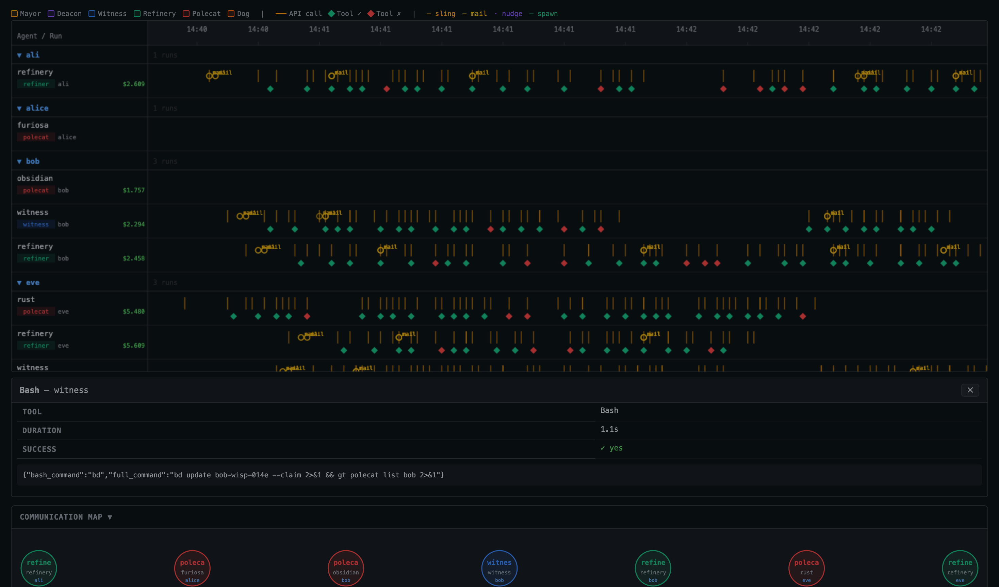

# gastown-trace

Observability web UI for the [Gastown](https://github.com/anthropics/gastown) multi-agent system. Queries [VictoriaLogs](https://docs.victoriametrics.com/victorialogs/) and renders a real-time waterfall view of all agent runs, API calls, tool executions and inter-agent communications.



## Features

- **Waterfall timeline** — Canvas-based swim-lane view of every agent run, grouped by rig. Zoom (scroll wheel) and pan (drag) the time axis.
- **Event markers** — API calls, tool results, slings, mails, nudges and spawns shown as inline ticks with colour-coded badges.
- **Detail panel** — Click any run bar or event marker to open a scrollable inspector (tool args, API payloads, prompt text).
- **Communication map** — SVG graph of all inter-agent messages (sling / mail / nudge / spawn) within the visible window.
- **Live filters** — Filter by rig, role or free-text search; URL-driven so bookmarkable.
- **Summary cards** — Run count, rig count, total events, bead count, estimated cost and wall-clock duration at a glance.

## Quick start

```bash
# From the gastown-otel repo root
cd gastown-trace
go build -o gastown-trace .
./gastown-trace --logs http://localhost:9428 --port 7428
```

Open [http://localhost:7428/waterfall](http://localhost:7428/waterfall).

### Flags

| Flag | Default | Description |
|------|---------|-------------|
| `--logs` | `http://localhost:9428` | VictoriaLogs base URL |
| `--port` | `7428` | HTTP listen port |

### Time window

Use the toolbar in the top-right corner to select `1h / 24h / 7d` windows, or pick a custom `start → end` range with the date-time inputs.

## How it works

`gastown-trace` runs three discovery passes against VictoriaLogs to build the run list:

1. **`agent.instantiate`** — primary root event (new-style instrumentation), carries `run.id`, `role`, `rig`, `instance`.
2. **`session.start`** — legacy fallback for agents that predate `agent.instantiate`.
3. **`agent.event` / `bd.call` / `mail`** — catch-all for agents that emit neither of the above; role and rig are derived from the tmux session name (`{rig}-{role}` pattern).

All events are correlated by `run.id` (the `GT_RUN` UUID propagated via `OTEL_RESOURCE_ATTRIBUTES`).

## Stack

- **Backend** — Go `net/http`, `html/template`, VictoriaLogs HTTP API (LogsQL)
- **Frontend** — plain HTML + CSS + vanilla JS, HTML Canvas for the waterfall, SVG for the comm map — no build step, no dependencies
